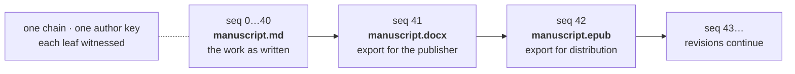

# Document Formats — Why Hashes Differ, and What to Register

**Status:** design proposal · **Companion to:** [`wire-format.md`](./wire-format.md) §6, [`registry-and-provenance.md`](./registry-and-provenance.md)

A creator has one manuscript. It exists as a Google Doc, a `.docx` export and an `.epub`. Three
files, three hashes, none of which verify against the others.

This looks like a bug and is not one. But the system currently offers no guidance, and without it
a creator's reasonable expectation — *"it's the same book"* — collides with the format's
correct-but-unhelpful answer.

---

## Do not fix this by normalising before hashing

The temptation is to normalise text before computing `content_commit`, so the three files agree.
`wire-format.md` §2 already refuses this and the reason has not weakened:

> Normalisation tables change between Unicode versions, so a normalised hash would depend on which
> Unicode revision the implementation was built against.

A hash that depends on the implementation's Unicode version is a hash that stops verifying when
someone upgrades a library. It would fail years later, silently, in exactly the situation where
the proof was needed. **Hashed bytes stay raw.** Everything below works within that.

---

## The part that will actually bite: containers are not byte-stable

This is worse than "different formats differ", and it is the thing to warn creators about first.

**`.docx` and `.epub` are ZIP archives, and re-saving an unmodified document changes the bytes.**
Not the text — the container. Sources of drift:

| Source | Effect |
| --- | --- |
| `w:rsid` revision-save identifiers | new IDs written on each editing session |
| `docProps/app.xml` | `TotalTime`, revision count, last-edited-by change |
| ZIP entry order and timestamps | vary by writer and by run |
| Producer metadata | changes with the application version |

So *open and save with no edits* produces a different hash. A creator who exports again to check
their registration will find it does not match, and will reasonably conclude something is wrong.
Nothing is wrong; they made a new file.

**A Google Doc has no byte representation at all.** There is no file — the export is generated on
demand, and its bytes can change when Google changes their software, with no action by the
creator. You cannot register a Google Doc. You can only register an export, which is a snapshot
of a thing that has no canonical form.

---

## The reframe: a conversion is a revision

The instinct is to make the hashes match. They should not match — they are different artifacts,
and a system that claimed otherwise would be lying about which bytes it saw.

What should connect them is **the chain**, which already exists for exactly this. Same work,
different bytes, over time, with continuity that is witnessed rather than asserted:

Each export is a leaf. Its `content_commit` is the bytes of that export, honestly. The claim
"these are the same work" is carried by chain position and a shared author key — not by a hash
collision that would have to be manufactured.

This costs nothing and requires no format change. It is what the append-only log is for.

---

## Guidance for creators

**1. Register the artifact you will keep.** The hash proves that file existed. If you cannot
produce the file later, the proof is weaker — you can still show the hash, but not the thing it
commits to.

**2. Prefer a format you control the bytes of.** Markdown, plain text, or any single-file format
your editor writes deterministically. `.docx` and `.epub` are fine to register; just understand
that you are registering *that export*, not the document that produced it.

**3. Do not re-export to check.** It will not match, and that is expected. To check a
registration, hash the file you kept.

**4. If you want format independence, make the text the work.** Register the extracted text as
its own artifact and treat every layout format as a derivative of it. That gives one stable
identity that survives any number of exports, and it needs nothing from the format that does not
already exist.

**5. A Google Doc is not registrable.** Export it, register the export, and keep it.

---

## What the app must do

Requirements on DAON's own surfaces, currently **unimplemented**.

**Never present a hash mismatch as suspicion.** A re-exported `.docx` failing to match is the
overwhelmingly common case and it is innocent. Language like "this content could not be verified"
invites a creator to think they have been robbed. The honest phrasing is that this file is not the
file that was registered, followed by the reason it usually happens.

**Say which artifact was registered.** Filename, size and format at registration, so a creator can
tell whether they are holding the right file before concluding anything.

**Offer registering a conversion as a revision** rather than as a new work, when the creator has
an existing chain. This is the one place the app can turn a confusing outcome into the correct
action.

**Never claim two artifacts are the same work.** DAON has no standing to decide that. It can show
that two leaves sit in one chain, which is a fact about the log; it must not infer equivalence
from text similarity, and it must not display a similarity score. That would be a purity signal in
everything but name — see
[`registry-and-provenance.md`](./registry-and-provenance.md).

---

## Canonical text, for matching only

The registry's `verify-content` needs to answer *"have I seen this text before"* across formats.
That is a **search and matching** problem, and it is the only place normalisation belongs.

**This is a derived value. It is never hashed into a leaf and never appears in the wire format.**

Minimal, and deliberately so:

| Step | Rule |
| --- | --- |
| Extraction | `.docx`: `w:t` runs in document order. `.epub`: XHTML in spine order, markup stripped. Plain text: as-is |
| Encoding | UTF-8, BOM removed |
| Unicode | NFC |
| Line endings | CRLF and CR → LF |
| Everything else | **unchanged** |

What is deliberately **not** done, and why:

- **No whitespace collapsing.** Spacing is content in poetry, in code samples, in concrete verse.
  Collapsing it would make two genuinely different works look identical.
- **No case folding.** Same reason, and it is lossy in ways that vary by locale.
- **No punctuation folding.** Smart quotes and straight quotes are a real difference. A creator
  may have chosen.

Aggressive normalisation buys a few more matches and creates false ones. For a system whose
output is used in disputes, a false match is far worse than a missed one.

**A canonical-text match is a weaker claim and must be labelled as one.** It says the text
corresponds. It does not say the file is the file, and it must never be rendered in a way that
implies it does.

---

## Open

- **Whether a leaf should ever carry a text commitment** alongside `content_commit` — a
  `text_commit` over the canonical form, so format independence is provable rather than
  conventional. It is a format version bump and it is not obviously worth it, since guidance 4
  above achieves the same result with no format change. Recorded so it is a decision rather than
  an omission.
- **Extraction stability.** `.docx` text extraction depends on the library. Two implementations
  disagreeing about `w:t` handling would produce different canonical text and therefore different
  match results. If canonical text is ever used for anything a creator relies on, it needs a
  reference implementation and vectors, exactly as the wire format has.
- **Where extraction runs.** Doing it server-side means uploading the document, which the
  provenance design has so far avoided entirely — the agent sends commitments, never content.
