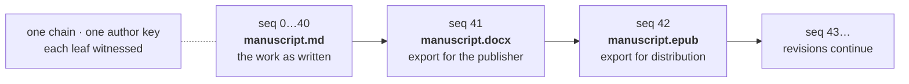
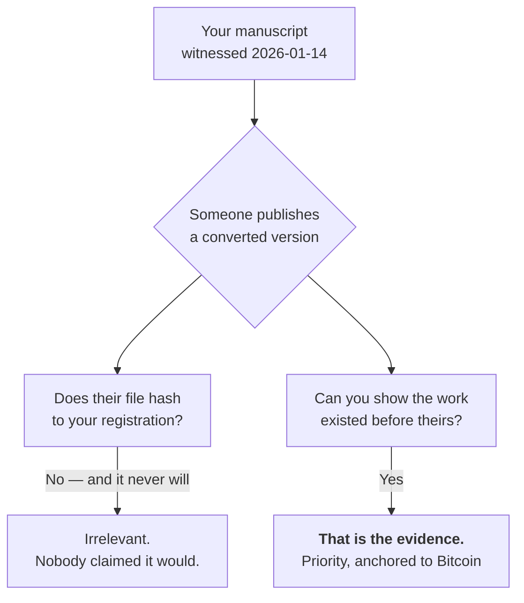

# Document Formats — Why Hashes Differ, and What to Register

**Status:** design proposal · **Companion to:** [`wire-format.md`](./wire-format.md) §6, [`registry-and-provenance.md`](./registry-and-provenance.md)

A creator has one manuscript. It exists as a Google Doc, a `.docx` export and an `.epub`. Three
files, three hashes, none of which verify against the others.

This looks like a bug and is not one. But the system currently offers no guidance, and without it
a creator's reasonable expectation — *"it's the same book"* — collides with the format's
correct-but-unhelpful answer.

---

## Do not fix this by normalising before hashing

The temptation is to normalise text before computing `content_commit`, so the three files agree.
`wire-format.md` §2 already refuses this and the reason has not weakened:

> Normalisation tables change between Unicode versions, so a normalised hash would depend on which
> Unicode revision the implementation was built against.

A hash that depends on the implementation's Unicode version is a hash that stops verifying when
someone upgrades a library. It would fail years later, silently, in exactly the situation where
the proof was needed. **Hashed bytes stay raw.** Everything below works within that.

---

## The part that will actually bite: containers are not byte-stable

This is worse than "different formats differ", and it is the thing to warn creators about first.

**`.docx` and `.epub` are ZIP archives, and re-saving an unmodified document changes the bytes.**
Not the text — the container. Sources of drift:

| Source | Effect |
| --- | --- |
| `w:rsid` revision-save identifiers | new IDs written on each editing session |
| `docProps/app.xml` | `TotalTime`, revision count, last-edited-by change |
| ZIP entry order and timestamps | vary by writer and by run |
| Producer metadata | changes with the application version |

So *open and save with no edits* produces a different hash. A creator who exports again to check
their registration will find it does not match, and will reasonably conclude something is wrong.
Nothing is wrong; they made a new file.

**A Google Doc has no byte representation at all.** There is no file — the export is generated on
demand, and its bytes can change when Google changes their software, with no action by the
creator. You cannot register a Google Doc. You can only register an export, which is a snapshot
of a thing that has no canonical form.

---

## Conversions you make: record them as revisions

The instinct is to make the hashes match. They should not match — they are different artifacts,
and a system that claimed otherwise would be lying about which bytes it saw.

What should connect them is **the chain**, which already exists for exactly this. Same work,
different bytes, over time, with continuity that is witnessed rather than asserted:



Each export is a leaf. Its `content_commit` is the bytes of that export, honestly. The claim
"these are the same work" is carried by chain position and a shared author key — not by a hash
collision that would have to be manufactured.

This costs nothing and requires no format change. It is what the append-only log is for.

**This only covers conversions you perform.** For everything else, see the next section — which is
the larger half of the problem.

---

## Conversions you do not control

Most conversions of a creator's work are not made by the creator.

A publisher builds the `.epub`. A distributor re-encodes on ingest. Kindle Direct Publishing
converts on upload. A reader exports to PDF. An aggregator re-flows the text into HTML. **None of
these can be a leaf in the creator's chain, because none of these parties hold the author key —
and they must not.**

So the version that actually circulates is routinely one the creator never signed and cannot sign.
An honest system has to say what it does about that, and the answer is not comfortable:

> **A byte-exact commitment cannot establish that two different files are the same work.** No hash
> scheme can. This is inherent to hashing, not a gap in this design, and no amount of
> normalisation closes it — a normalised hash is still exact, just exact about something else.

That sounds worse than it is, because it answers a question nobody needs answered.

### The claim that survives is priority, not equivalence

Consider the dispute this system exists for. A creator's manuscript is taken, converted, and
published by someone else who claims it.

The creator does not need to prove the infringing `.epub` hashes to their registration. **They need
to prove they had the work first**, and that is exactly what a witnessed leaf establishes: this
text existed, in this form, at a time anchored to Bitcoin, months before the other party's
publication.

Whether the two documents are the same work is a question of reading them. That is an ordinary
evidentiary question, decided the way it has always been decided, and it is not one DAON has any
standing to answer. What DAON supplies is the part that is otherwise hard: an unforgeable date.



### The unit of dispute is a passage, not a file

The gloom above assumes the thing being fought over is a whole document. It usually is not.

Infringement is normally **fragments of a larger work** — three paragraphs lifted into someone
else's article, a chapter re-flowed into a course pack, a section absorbed into a model's output
and reproduced. The creator's registered artifact is the novel; the dispute is about eight hundred
words of it.

**The format already proves this, and it was built to.** `content_commit` is a Merkle tree over
1 KiB segments, not a flat hash of the file, specifically so a holder can prove one part without
revealing the rest:

```
disclose( segment_bytes, index, sibling_hashes )  →  verifies against content_commit
```

So the claim available to a creator is narrower and much more useful than "my file matches
theirs":

> **This passage was in my work, and my work was witnessed on this date.**

Note what that does *not* require. It does not require the infringer's file. It does not require
their bytes to resemble yours, or their format to be yours, or any conversion to have preserved
anything. It is a statement about the creator's own artifact and when it existed — which is
exactly the fact that is otherwise hard to establish, and the only one a timestamp can supply.

Byte-identity of the derivative stops being a problem the moment the question is framed this way,
because the derivative never enters the proof.

### On the evidentiary role, carefully

Establishing that specific content existed at a specific time, with a timestamp that does not
depend on the creator's own say-so, is a familiar and well-understood evidentiary function. It is
what a notarised deposit or a dated envelope has always been for, done in a way that does not
require trusting the depositor, DAON, or a single institution's records.

**Substantial similarity is a separate question and stays with people.** Whether one work copies
another is decided by reading them, in a forum with standing to decide it, against a standard that
varies by jurisdiction and by medium. Nothing here computes that, and nothing here should.

The division is the useful part. The hard-to-prove fact — *this existed, then* — becomes cheap and
checkable. The judgement — *and that is copying* — stays where judgement belongs.

### This stays creator-initiated

`wire-format.md` §6 is normative that **DAON never issues, renders or serves segment-level
detail**: there is no `?segment=` parameter on any endpoint, deliberately. A creator generates a
segment proof themselves, from content only they hold.

That constraint was written to stop passage disclosure becoming a surface anyone could point at a
creator. It is unaffected by anything here — this section describes a creator choosing to prove
one passage of their own work, which is the case the capability exists for.

Two costs that are real and are not hidden by this framing. A 1 KiB boundary has no relationship
to a paragraph, so disclosing a passage discloses the segments it spans and may reveal adjacent
text the holder did not intend. And any tool offering this **must** show the holder the exact
bytes that will be disclosed first — consent to reveal a passage is not consent to reveal whatever
shares its segment.

### What this changes about the guidance

It strengthens the case for making the **text** the registered work rather than a layout format.
Extracted text from a third party's `.epub` has a real chance of corresponding to a registered
text artifact. Extracted text from a `.docx` you registered has a worse chance, because the
container carries structure the converter will have rewritten.

It also means the registry's matching layer is not a convenience. It is the only mechanism that
can connect a circulating derivative to a registration at all, which is why the canonical form
below matters more than its small role suggests.

And it argues for **registering often rather than once**. A single registration at publication
proves the finished work existed that day. A chain of revisions proves the passage in dispute
existed months earlier, in draft, alongside everything around it — which is a far harder thing for
anyone to have manufactured after the fact.

### What it does not license

DAON must not start asserting that a derivative *is* the registered work. It can report that the
canonical text of one corresponds to the other, with that phrasing and its limits attached. The
step from "the text corresponds" to "this is the same work, and therefore this person is
infringing" belongs to people with standing to take it. Automating it would make DAON an
adjudicator, which is the thing the whole design refuses to become.

---

## Guidance for creators

**1. Register the artifact you will keep.** The hash proves that file existed. If you cannot
produce the file later, the proof is weaker — you can still show the hash, but not the thing it
commits to.

**2. Prefer a format you control the bytes of.** Markdown, plain text, or any single-file format
your editor writes deterministically. `.docx` and `.epub` are fine to register; just understand
that you are registering *that export*, not the document that produced it.

**3. Do not re-export to check.** It will not match, and that is expected. To check a
registration, hash the file you kept.

**4. Register often, not once.** A single registration at publication proves the finished work
existed that day. A chain of revisions proves the disputed passage existed months earlier, in
draft, surrounded by the work it grew out of — which is much harder for anyone to have
manufactured after the fact. This is what the coalescing agent is for; it costs nothing per leaf.

**5. Make the text the work.** Register the extracted text as its own artifact and treat every
layout format as derived from it. This is the strongest single thing a creator can do: it gives one
stable identity that survives any number of exports, and it is the form most likely to correspond
to text extracted from a conversion **somebody else** made. It needs nothing the format does not
already have.

**6. A Google Doc is not registrable.** Export it, register the export, and keep it.

---

## What the app must do

Requirements on DAON's own surfaces, currently **unimplemented**.

**Never present a hash mismatch as suspicion.** A re-exported `.docx` failing to match is the
overwhelmingly common case and it is innocent. Language like "this content could not be verified"
invites a creator to think they have been robbed. The honest phrasing is that this file is not the
file that was registered, followed by the reason it usually happens.

**Say which artifact was registered.** Filename, size and format at registration, so a creator can
tell whether they are holding the right file before concluding anything.

**Offer registering a conversion as a revision** rather than as a new work, when the creator has
an existing chain. This is the one place the app can turn a confusing outcome into the correct
action.

**Never claim two artifacts are the same work.** DAON has no standing to decide that. It can show
that two leaves sit in one chain, which is a fact about the log; it must not infer equivalence
from text similarity, and it must not display a similarity score. That would be a purity signal in
everything but name — see
[`registry-and-provenance.md`](./registry-and-provenance.md).

---

## Canonical text, for matching only

The registry's `verify-content` needs to answer *"have I seen this text before"* across formats.
That is a **search and matching** problem, and it is the only place normalisation belongs.

**This is a derived value. It is never hashed into a leaf and never appears in the wire format.**

Minimal, and deliberately so:

| Step | Rule |
| --- | --- |
| Extraction | `.docx`: `w:t` runs in document order. `.epub`: XHTML in spine order, markup stripped. Plain text: as-is |
| Encoding | UTF-8, BOM removed |
| Unicode | NFC |
| Line endings | CRLF and CR → LF |
| Everything else | **unchanged** |

What is deliberately **not** done, and why:

- **No whitespace collapsing.** Spacing is content in poetry, in code samples, in concrete verse.
  Collapsing it would make two genuinely different works look identical.
- **No case folding.** Same reason, and it is lossy in ways that vary by locale.
- **No punctuation folding.** Smart quotes and straight quotes are a real difference. A creator
  may have chosen.

Aggressive normalisation buys a few more matches and creates false ones. For a system whose
output is used in disputes, a false match is far worse than a missed one.

**A canonical-text match is a weaker claim and must be labelled as one.** It says the text
corresponds. It does not say the file is the file, and it must never be rendered in a way that
implies it does.

---

## Open

- **Whether a leaf should ever carry a text commitment** alongside `content_commit` — a
  `text_commit` over the canonical form, so format independence is provable rather than
  conventional. This is worth more than it first appeared: it would let a creator prove that a
  third party's conversion carries their text, rather than only that their own artifact predates
  it. It is a format version bump, it inherits every extraction-stability problem below, and it
  puts a normalised value inside the hashed layer, which §2 of the wire format resists for good
  reasons. Genuinely undecided.
- **Extraction stability.** `.docx` text extraction depends on the library. Two implementations
  disagreeing about `w:t` handling would produce different canonical text and therefore different
  match results. If canonical text is ever used for anything a creator relies on, it needs a
  reference implementation and vectors, exactly as the wire format has.
- **Where extraction runs.** Doing it server-side means uploading the document, which the
  provenance design has so far avoided entirely — the agent sends commitments, never content.
