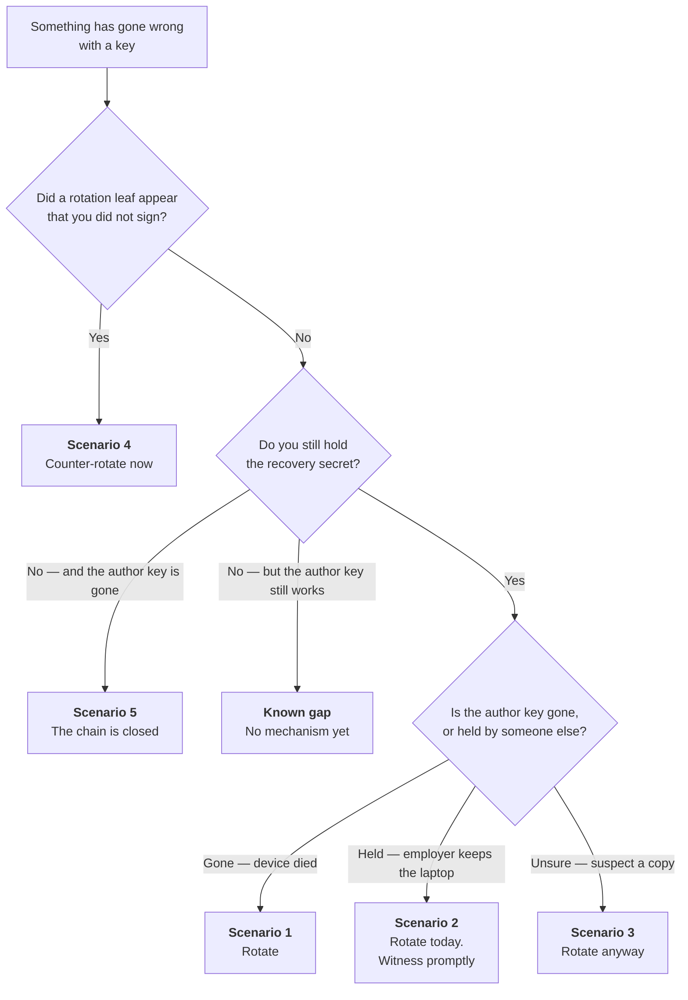
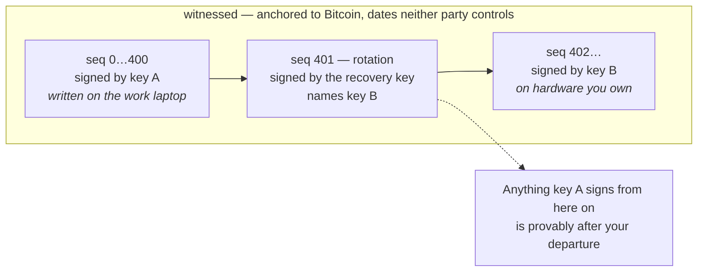

# Key Recovery Runbook

**Status:** ⚠️ **procedure for a mechanism that is not built yet** · **Companion to:** [`key-recovery.md`](./key-recovery.md)

> **Read this first.** Rotation and transfer leaves are **designed but not implemented**. Nothing
> in `provenance/` can produce one today — `grep -ri rotation provenance/*/src` returns nothing.
> This document exists so the procedure is settled before the code is written, and so the
> implementation has something to be checked against. It is **not** instructions a creator can
> follow right now, and it must not be published to creators until the mechanism ships.

## Which situation are you in?

Selling or handing the work on is not recovery at all — see § *Scenario 6*.

The two keys, and what each is for:

| | Held where | Can do |
| --- | --- | --- |
| **Author key** | the agent's credential store, synced across the creator's devices | sign revision leaves |
| **Recovery key** | wherever the creator put it at genesis — never beside the author key | sign **one** thing: a rotation leaf naming a new author key |

---

## Before anything goes wrong

Everything below depends on a decision made at genesis, on a day when nothing was wrong. There is
no step later that substitutes for it.

**At identity creation the agent shows the recovery secret exactly once.** Put it somewhere that
satisfies both conditions:

1. **Not on the device holding the author key.** One dead laptop must not take both.
2. **Not in anyone else's custody.** Not a work machine, not a managed Apple Account, not work
   email, not a corporate or team vault — see [`key-recovery.md`](./key-recovery.md) § *Custody
   domains*. A personal password manager on a personal account is fine even though it syncs; the
   company's shared vault in that same product is not. The question is never where it sits, only
   who can be told to hand it over.

Paper in a drawer at home satisfies both and requires no software to be working. It remains the
recommendation.

**If the agent warns that the machine looks centrally managed** (`keystore::is_managed_device`),
take it seriously and read § *Scenario 2* now rather than later. That warning is a hint, not a
control — it can miss. A quiet check is not evidence the device is yours.

---

## Scenario 1 — The device died; the recovery key is safe

The ordinary case. The author key is gone; nothing has been captured.

1. Install the agent on the replacement device.
2. Create a **new author key** there.
3. Sign a **rotation leaf** with the recovery secret, naming the new author key.
4. Let the leaf be witnessed.

The chain continues. Everything before the rotation stays valid and stays attributed — it is
witnessed and does not depend on the old key still existing.

**Then replace the recovery key too, once that mechanism exists.** See § *Known gap*.

---

## Scenario 2 — You left an employer and the key was on their laptop

Treat as **compromise, not loss**. The key is not gone; someone else has it and can sign as you.

**Do this on the day you know, not the day you get around to it.** The rotation's value is the
witnessed timestamp: it fixes a boundary neither party controls, so anything the retained key
signs afterwards is provably after your departure.

1. On hardware you own, create a new author key.
2. Sign a rotation leaf with the recovery secret.
3. **Get it witnessed promptly.** An unwitnessed rotation leaf has no anchored date, which is the
   entire point here.
4. Note what the old key signed and when. Everything up to the rotation reads as yours in the
   chain, which may or may not match the contract — the chain records who signed, never who owns.

**If the recovery secret was also in the employer's custody** — the work laptop, the team vault,
work email — you have lost the ability to rotate, and so has nobody else gained it: they hold both
keys. Skip to § *Scenario 5*. This is the case the genesis rule exists to prevent, and there is no
remedy for it after the fact.

What the rotation buys you, drawn out:

**What you cannot stop.** They keep the old key and may fork the chain from an earlier head. The
defence is structural: your genuine leaves were witnessed as you wrote them, and a fork made later
carries a later first witness. That is evidence, not prevention, and it only helps if someone
looks.

---

## Scenario 3 — You suspect the author key was copied but still have the device

Same as Scenario 2. Rotate. There is no test that distinguishes "copied" from "not copied", so
suspicion is sufficient grounds — rotation is cheap and the alternative is unbounded.

---

## Scenario 4 — A rotation leaf appeared that you did not sign

Someone has your recovery secret.

1. **Counter-rotate immediately** with the same recovery key, naming a key only you hold.
2. Get it witnessed. Both rotations sit in the chain; ordering is established by Bitcoin rather
   than by either party's claim, so the later one governs.
3. Assume the recovery secret is burned and everywhere it was stored is compromised.

Rotation cannot be undone, only superseded. Whoever moves last, wins — which means whoever
*notices* wins, and detection assumes someone is looking.

---

## Scenario 5 — Both keys are gone

**The chain is closed.** There is no third mechanism, deliberately: anything that could restore
access without either key would be a backdoor, and a backdoor DAON holds would make DAON the
authority this design refuses to be.

What survives:

- **Everything already written stays verifiable, forever.** Witnessed history does not depend on
  any key still existing. The work is still provably yours as of its witnessed dates.
- **What ends is the future.** Nothing more can be appended to that entity.

The remedy is to start a new entity for new work and accept the discontinuity. If the old chain
matters to a claim, it is still evidence — it just cannot grow.

---

## Scenario 6 — Selling or handing over the work

Not recovery; the ordinary case, and it needs none of the above because the outgoing key exists.

Sign a **transfer leaf** with the outgoing **author** key, naming the new owner's author key
**and a new recovery key**. Both must change: a transfer that carried the old recovery key forward
would let the seller rotate the chain back later.

The new owner inherits a chain they cannot alter. They extend it; they do not acquire authorship
of what came before.

---

## Known gap

**Whether the recovery key can itself be rotated is unresolved** — it is an open question in
`key-recovery.md`. Today a compromised recovery key threatens an entity permanently, and Scenario
1's closing instruction ("replace the recovery key too") has nothing to call.

`key-recovery.md` names "signed by the author key" as the obvious candidate, since it inverts the
trust direction cleanly. **This should be decided before the rotation mechanism is implemented**,
not after, because retrofitting it means a second format change.

---

## For whoever implements this

- Rotation is authorised by the **recovery** key; transfer by the outgoing **author** key. They
  produce the same shape of leaf and must not be conflated.
- Rotation takes effect **immediately, at its own `seq`**. The delayed variant discussed in
  `key-recovery.md` should not be built: it protects against a stolen recovery key, but Scenario 2
  is a stolen *author* key held by a motivated party, and a delay window is time in which the old
  key still validly signs.
- A rotation leaf must be **distinguishable from a content leaf** without an algorithm-agility
  field, which the format deliberately lacks. Still open in `key-recovery.md`.
- The minimum verifier must not grow a step. A leaf signed by the `author_key` *in that leaf* is
  valid; whether the key legitimately changed is an audit question answered by walking the chain.
- The agent must **never** persist the recovery secret. `RecoverySecret` is not `Clone` and
  `reveal()` consumes it, so there is currently no path to. Keep it that way.
