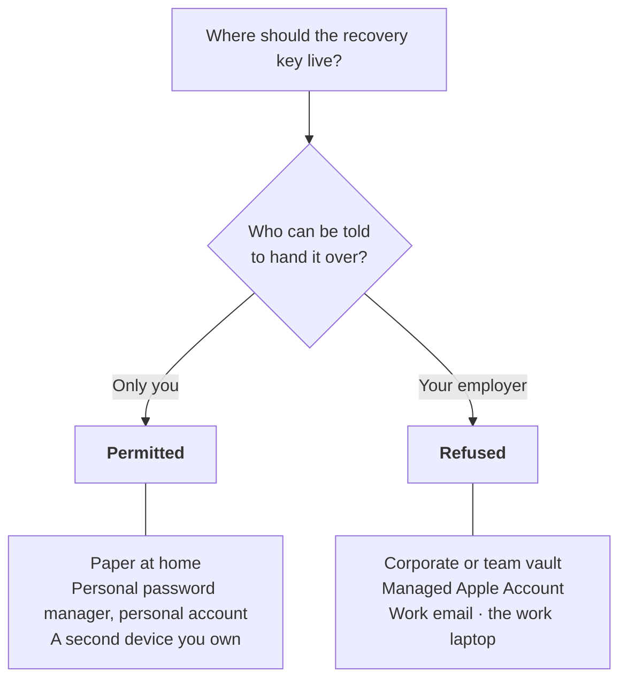

# Key Recovery and Rotation

**Status:** design proposal · **The last undefined thing in the format**
**Companion to:** [`wire-format.md`](./wire-format.md) §7, [`key-authorization.md`](./key-authorization.md)

`recovery_key` is committed in every leaf and its semantics are undefined. This proposes them.

---

## The problem it exists for

Under Option A one key extends an entity for its lifetime. Lose it and the chain freezes: history
stays verifiable but can never be extended, and for a work in progress the continuity *was* the
evidence. A fourteen-month chain that stops dead is a real harm, which is why the field was
reserved before anything shipped.

## The knot

If rotation is authorised by the outgoing key, a **lost** key cannot sign its own rotation — and
loss is the entire case `recovery_key` exists for. So the rule cannot be "the old key blesses the
new one."

## What compromise can and cannot do

Worth establishing first, because it bounds how much the rest matters.

**Neither key can alter what already exists.** Every leaf is under a witnessed head anchored to
Bitcoin. Rewriting history would require a SHA-256 collision or rewriting Bitcoin. So the worst
case for *any* key compromise is control of the **future** of a chain, never its past.

That is a meaningful floor. An attacker who steals both keys still cannot make it look as though
they wrote the manuscript — the existing revisions, with their timestamps, are beyond reach.

---

## Proposal

### 1. Narrow what the recovery key may do

`recovery_key` may sign **exactly one thing**: a rotation leaf naming a new `author_key`. It may
never sign a content revision.

This is the difference between "a second key that can do everything" and "a key that can only
hand over the baton." A stolen recovery key cannot quietly append revisions in the creator's
voice; it can only perform an act that is, by construction, visible.

### 2. Rotation is an ordinary leaf

A rotation leaf sits in the chain like any other: sequenced, hashed, witnessed. It is not a
side-channel or a registry entry.

Consequences, all wanted:

- **A hostile takeover is detectable.** An unexpected rotation leaf appears in the creator's own
  chain. Detection is not prevention, but silent takeover is impossible.
- **It is ordered.** Witnesses establish when rotation happened relative to everything else, so
  "who controlled this chain on date X" is answerable.
- **It costs the verifier nothing.** A leaf signed by the `author_key` *in that leaf* is valid.
  The minimum verifier never asks whether the key legitimately changed — that is an audit
  question, answered by walking the chain, not a step in the four.

### 3. The recovery key must not live beside the author key

If both sit in the same Keychain on the same laptop, a stolen laptop takes both and a lost laptop
loses both. The field then buys nothing.

**Normative:** an agent must not store both keys in the same medium by default. The recovery key
is generated at genesis, shown to the creator once, and stored by them somewhere the author key
is not — paper, a password manager, a second device.

An agent may offer to keep it, but must make the tradeoff explicit rather than defaulting to
convenience.

### 4. Rotation cannot be undone, only superseded

A rotation leaf is append-only like everything else. A creator who discovers a hostile rotation
counter-rotates with the same recovery key, producing a later rotation leaf. Both are in the
chain, both are witnessed, and the ordering is established by Bitcoin rather than by either
party's claim.

This is why detection matters: the legitimate holder can always respond, provided they still hold
the recovery key and notice.

---

## The open decision: immediate or delayed

**Immediate.** A rotation leaf takes effect at its own `seq`. Simple, no new verifier rule, and a
stolen recovery key gives an attacker control from the moment they use it. The creator's recourse
is to counter-rotate as soon as they notice.

**Delayed.** A rotation takes effect only after N witnessed heads, or a fixed interval measured by
witness times. The creator gets a window to notice and counter-rotate before the new key can sign
anything.

Delay is genuinely stronger — it converts "detectable after the fact" into "preventable if you are
paying attention." It is also the only version that binds an attacker, because an attacker holding
the recovery key controls the agent and will ignore any policy that is not in the format.

It costs a verifier rule: the verifier must compare witness times to decide whether a rotation was
in effect for a given leaf. That is arithmetic on values it already holds rather than a chain
walk, so it is cheaper than the authorization chain Option C would have required — but it is a
fifth thing the minimum verifier does, and the data model says to protect the four.

**Recommendation: immediate, with delay reserved.** The floor established above does most of the
work — history cannot be altered, and takeover cannot be silent. Delay protects against a narrow
window in a case that requires the recovery key to already be stolen, and it spends the thing the
design most wants to keep. It can be added later behind a format version bump; the verifier rule
would be additive rather than a change to how existing leaves verify.

---

## Transfer is the easy case

Rotation and transfer produce the same shape of leaf and are authorised differently:

| | Why | Signed by |
| --- | --- | --- |
| **Rotation** | the key is lost or compromised | `recovery_key` |
| **Transfer** | ownership changes hands | the outgoing `author_key` |

Transfer has none of the knot above, because **the outgoing key exists.** The current owner is
present and can sign the handover. That is the ordinary case — a work sold, rights acquired, an
estate settled — and it needs no special mechanism.

The new owner inherits a chain they cannot alter. Everything up to the transfer is witnessed and
fixed; they can only extend it. So the record reads honestly:

```
seq 0…400    signed by key A        the author wrote these
seq 401      transfer, signed by A  naming key B
seq 402…     signed by key B        the new owner extends
```

A publisher who acquires a work gets the continuation and not a claim on the authorship of what
came before. That is the correct outcome and it falls out of the structure rather than needing a
rule.

### A transfer must replace both keys

**This is the part that would otherwise be a hole.** If a transfer leaf named a new `author_key`
but carried the previous owner's `recovery_key` forward, the seller could later sign a rotation
and take the chain back. They would be doing it visibly, but they would be able to do it.

So a transfer leaf names **a new `author_key` and a new `recovery_key`**, and the outgoing owner
retains nothing that can extend or reclaim the entity.

### What a former owner can still do

Nothing, on that chain. They may hold old key material, but leaves after the transfer must be
signed by the new `author_key`, and the chain is witnessed.

They could start a **competing chain** forked from an earlier head — as could anyone holding the
content. It resolves the way every competing claim does: on evidence. The transfer is in the
witnessed history, and a fork created afterwards carries a later first witness.

### Relationship to the registry's transfer

`MsgTransferOwnership` on the content registry is a different system with a different anchor,
exactly as described in [`registry-and-provenance.md`](./registry-and-provenance.md). It records
that DAON moved a registry entry between accounts. A provenance transfer records that a key
handed a chain to another key, witnessed against Bitcoin.

They can both happen for the same work and neither depends on the other. Nothing should try to
keep them in sync — two records that can disagree is worse than two records that are plainly
about different things.

---

## Rotating the recovery key

**Decided.** The `author_key` may sign a leaf naming a new `recovery_key`, and it takes effect
only after **N witnessed heads**, not at its own `seq`.

### Why the recovery key must be replaceable at all

A recovery key gets exposed in the ordinary course of being used. Scenario 1 of the runbook has
the creator type it into a machine to rotate a lost author key — if that machine was the problem,
the recovery key is now the problem. Without a way to replace it, the only remedy is abandoning
the chain, which is the outcome this whole document exists to prevent.

### Why the *author* key signs it

Each key may replace the other; **neither may replace itself.**

| Signed by | May replace | May not |
| --- | --- | --- |
| `recovery_key` | the `author_key` | the `recovery_key` |
| `author_key` | the `recovery_key` | the `author_key` |

The second row is the new rule. The first row's restriction is not new but is worth stating,
because symmetry with transfer suggests otherwise and symmetry is wrong here.

**A recovery-signed rotation must not replace the recovery key.** §4 says a hostile rotation is
answered by counter-rotating with the same recovery key — that defence exists *because* the
recovery key survives the rotation. If a rotation replaced it, a thief who obtained it would
install their own on first use and the legitimate holder would have nothing left to answer with.
Transfer replaces both keys deliberately, but transfer is authorised by the outgoing author key
and hands the entity away on purpose; rotation is a recovery from loss and must remain
answerable.

### Why delayed, when author-key rotation is immediate

Immediate would be simpler, and it is the wrong trade here — this is the one case where the
delayed variant reserved above earns its cost.

An immediate rule makes a stolen **author** key strictly more dangerous than it is today. A thief
would replace the recovery key first, and the creator would be left holding nothing; at present
their recovery key still rotates the thief out. Delay removes that: during the window the old
recovery key remains valid, so an unexpected recovery-rotation can be answered.

```
seq 400   author key A, recovery key R
seq 401   recovery-rotation, signed by A, naming R'    ← not yet in effect
seq 402   …
seq 415   N heads witnessed                            ← R' governs, R is dead
```

Hostile case, same leaves. The thief holds `A` and signs 401 naming their own `R'`. Because `R`
is still valid during the window, the creator answers:

```
seq 403   rotation, signed by R → new author key B     ← the thief's A is dead
                                                          their pending R' dies with it
```

A pending recovery-rotation is void if the author key that signed it is itself rotated out before
the delay elapses. Otherwise the thief's replacement would land after they had already been
removed.

### What it costs the verifier

**Not a fifth step.** The minimum verifier checks a signature against the `author_key` committed
*in that leaf* and never asks whether a key legitimately changed — that was already an audit
question, answered by walking the chain. The delay rule lives in the audit layer with the rest of
it. An auditor comparing witness times is doing arithmetic on values it already holds.

### Still to settle in implementation

- **What N is.** It must exceed the time a creator plausibly takes to notice, without leaving a
  compromised recovery key live for months. Days rather than hours or years.
- **Encoding.** A recovery-rotation leaf must be distinguishable from a rotation leaf and from a
  content leaf, which is the same open encoding question §*Open* already carries.

---

## Custody domains — when someone else owns the hardware

§3 says the two keys must not share a medium. Employment sharpens that into a different rule,
because the threat is not a thief but **a party with a legitimate claim to the device.**

A researcher, staff writer, in-house designer or journalist works on an employer-owned laptop.
They leave — or are laid off, or terminated with the machine collected the same afternoon, or the
device is remotely wiped by MDM. Whatever key sat on that laptop is now held by someone else, and
unlike a theft, nobody did anything wrong.

This is worse than losing access. **The employer can sign as the creator.** Where a lost key ends
a chain, a captured key continues it in someone else's hands.

### The rule that follows

The normative constraint is not "don't put both keys in one place." For work done on hardware
someone else controls it is:

> **Normative:** the recovery key MUST NOT be stored in any medium under the employer's control —
> the work laptop, a managed Apple Account, work email, or a corporate or team password vault. An
> agent MUST NOT offer to place it in one, and MUST NOT provide an export or integration path that
> ends in one.

The corporate password manager is the trap worth naming explicitly, because it is exactly where a
conscientious person would put a secret they were told to keep safe, and it is exactly wrong. It
is the employer's vault. Offboarding may empty it, and IT can read it.

**The axis is custody, not locality.** It is tempting to shorten this to "on-device password
managers only," and that is the wrong rule, because it collapses the recovery key onto the same
device as the author key — precisely what §3 forbids, and for the reason §3 gives: one dead laptop
then takes both. A recovery key that cannot survive the loss of the device is not a recovery key.

Sorting by who controls the medium rather than where it sits gives the right answer in every case:

| | Permitted | Why |
| --- | --- | --- |
| Paper the creator takes home | yes | outside anyone else's custody, survives the device |
| A personal password manager, personal account | yes | syncs, but the creator holds the account |
| A second device the creator owns | yes | §3's existing advice |
| A **team or corporate vault** | **no** | employer custody, whatever product it runs on |
| A managed Apple Account | **no** | employer custody |
| The work laptop | **no** | employer custody *and* beside the author key |

The same product can land on both sides of that table. A personal 1Password account is fine; the
company's shared vault in the same 1Password is not. That is not a contradiction — it is the point.
Nothing about the software matters here. Only who can be told to hand it over.



The same product can appear on both sides. That is the point: nothing about the software matters
here, only who controls the account.

### Structural, not procedural

The obvious mitigation — rotate before you lose the device — is unreliable, because departure is
frequently unannounced. Nobody gets warning of a layoff, and a terminated employee often does not
get ten minutes alone with the laptop.

So the protection has to hold **without anyone remembering to act.** That means the recovery key
was never in the employer's custody in the first place, which is a decision made at genesis, on a
day when nothing is going wrong. An agent that offers to "keep it safe for you" on a work machine
is offering to lose it for you.

### One identity per custody domain

The cleanest answer is not cryptographic. **Do not use a personal identity on an employer's
device.** Run a work identity there and keep the personal one on hardware you own.

This is the anthology reasoning again. If the work is made for hire and the employer holds the
copyright, then the employer's identity signing it is **correct, not a failure** — the chain is
recording something true. The failure case is narrower and more specific: a creator's *personal*
identity, which vouches for work they own, captured on hardware they do not.

Separating the two makes the ordinary case honest and the bad case impossible, which is a better
result than any key ceremony.

### Rotation makes the boundary a fact

For a creator who did put a personal key on a work machine, rotation is the remedy and it does
something better than revocation: it **puts a witnessed date on the boundary.**

```
seq 0…400   signed by key A     the creator's work, witnessed as it happened
seq 401     rotation, by recovery key, naming key B
seq 402…    signed by key B     on hardware the creator owns
```

Anything the retained key A signs afterwards is not merely disputed — it is provably after a
timestamp neither party controls. An unbounded risk becomes a dated one. A creator leaving a job
should rotate promptly for exactly this reason: the value is in the anchor, not the revocation.

### This settles the immediate-versus-delayed question

The open decision above leans immediate; this scenario decides it.

Delayed rotation exists to protect against a stolen **recovery** key, by giving the creator a
window to counter-rotate. But here the compromised key is the **author** key, and the holder is a
motivated party who knows exactly what they have. A delay window is time in which the old key
still validly signs. **Immediate**, and the delayed variant should not be built for this.

### What remains

The employer keeps key A forever, and can fork the chain from an earlier head. That resolves the
way §"What a former owner can still do" describes — the genuine branch was witnessed
contemporaneously and a later fork carries a later first witness.

But the limit below about detection bites harder here than anywhere else in this document. An
abandoned chain going unwatched is bad luck. This is a **motivated** adversary who knows the
chain exists, knows what it is worth, and had months of legitimate access.

---

## Honest limits

- **A stolen recovery key means a stolen future.** Nothing here prevents that; it makes it visible
  and reversible-by-supersession.
- **A creator who loses both keys has lost the chain.** There is no third mechanism, deliberately.
  Anything that could restore access without either key would be a backdoor, and a backdoor with
  DAON holding it would make DAON the authority the whole design refuses to be.
- **Detection assumes someone is looking.** An abandoned chain can be rotated without anyone
  noticing. This is inherent to a system with no central registry to alert.

## Open

- ~~Whether the recovery key may itself be rotated.~~ **Decided: yes, author-signed and delayed.**
  See § *Rotating the recovery key* below.
- Encoding. A rotation leaf needs to be distinguishable from a content leaf without an
  algorithm-agility field, which the format deliberately lacks.
