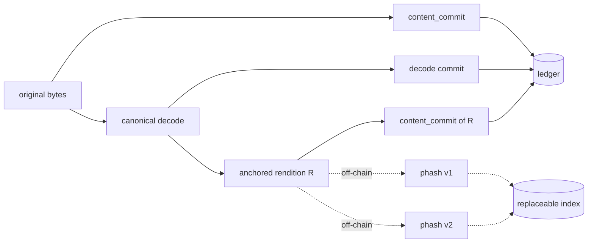

# Robust Identity for Non-Text Works (Design)

**Status:** draft · **nothing on this page is built** · September 2026
**This page proposes a scope change.** See *What this changes* below; it is the first thing to read.
**Feeds:** Pillar 2 (binary verification) · NGI Zero Commons milestones — *Threat Model*, *Specification v1.0*

---

## The gap

`content_commit` is exact, and that is correct. An adjudicator holding the bytes must reproduce the
commitment in an arbitrary language years later, and every robustness feature we could add to the
hash is a feature that implementer must also reproduce. Exactness is what makes the commitment
checkable at all.

But exactness has a cost that lands entirely on non-text work. The normal life of a picture on the
internet is re-encoding. A registered PNG is saved as JPEG at quality 85, or resized by a CMS, or
stripped of EXIF by an upload pipeline, and the bytes change completely. The commitment breaks. The
work is orphaned from its own record while remaining, to every human who looks at it, the same
picture.

This is live, not hypothetical. File registration ships today and commits with `content_commit`, so
every image and audio file registered right now carries an identity that dies the first time
anything re-encodes it.

Text mostly escapes this because canonicalisation already absorbs the variation — that is what
canonicalisation is *for*. This document asks what the equivalent move is for pixels and samples,
and how far it can be pushed before it stops being cryptography.

---

## What this changes, and what it does not

Three documents currently place this territory out of scope. An earlier draft of this page walked
past all three without noticing. Stating them explicitly, and saying precisely which one moves:

**`documentation/project/PROTOCOL_SCOPE.md` — "Similarity / fuzzy matching → Out of scope."**
**This is the one that changes**, and less than the table suggests. The same document says
similarity "would require fuzzy hashing or embedding comparison — a different system, off-chain,"
which is exactly where this page puts it. What moves is that DAON acknowledges such a system and
defines its boundary, rather than pretending it will never exist.

**`FEATURES.md` — "No similarity or 'purity' scoring, ever."**
**Unchanged.** Nothing here produces a score, renders one, exports one, or attaches one to a work.
What is added is a refusal on *exact* correspondence — a computation — and a *recorded,
non-public* note where correspondence is only approximate. Neither is a score, and the distinction
is enforced structurally below rather than promised.

**`docs/design/decisions.md` — "DAON never asserts two artifacts are the same work. It can report
that canonical text corresponds, with that phrasing and its limits attached."**
**Unchanged, and now applied literally.** Every tier below is phrased as *correspondence*. The
phrase "the same work" does not appear in any claim this system makes. An earlier draft used it
twice and marked it stateable as fact; that was the error this revision exists to fix.

Also unchanged, and load-bearing throughout: the derivation profile is a litigation instrument
only, disclosed by the holder inside adjudication, never an ambient signal or badge.

---

## The principle that governs the whole design

> **Ownership up to the point of check-in is cryptographic. Everything past that is litigable.**

The ledger proves a specific work was registered at a specific time. What happens to it
*afterwards* — a crop in a dataset, a re-encode on a stock site, a frame in a training corpus — is
not a claim the ledger can settle. It is a dispute, and disputes are settled on evidence by people,
not by a Hamming distance.

Two consequences follow, and they decide every open question below.

**The design target is an evidentiary package, not an enforcement mechanism.** We are not building
a system that decides whether infringement occurred. We are building one that lets a creator walk
into a dispute holding a dated, immutable, third-party-verifiable record, plus a reproducible
method for relating a found artifact to it.

**Reproducibility beats accuracy.** A matcher that is 78% accurate and whose result any opposing
party can independently recompute from published algorithms over anchored inputs is worth more in a
dispute than a 95%-accurate proprietary black box. The black box's number is an assertion. Ours has
to be a demonstration. This inverts the usual optimisation target and it is the reason for most of
what follows.

---

## Whose claim is it? Two paths of very different strength

This has to come before anything about refusal, because it decides what a refusal could possibly
mean.

**The provenance agent path** is key-backed. The creator holds an Ed25519 `author_key` and signs
their own leaves. A claim on this path is cryptographically attributable to a keyholder.

**The registry path — the app, and the great majority of registrations — is not.** The chain's
`creator` field is the API's own wallet, loaded from `API_MNEMONIC`, identical for every
registration ever made. The chain does not record that a person registered something; it records
that *the DAON API* registered a hash at a time. Ownership lives off-chain, as
`protected_content.user_id → users.id`, where a user is an email address from a magic link or an
OAuth identity. `/protect` currently uses optional auth, so a registration may carry no owner at
all.

`decisions.md` already names what that means: **the database association is a finding aid, not
evidence.**

The consequence is sharp. On the registry path, refusing person B's registration on account of
person A's record means refusing B on behalf of A **where neither party holds a key and A's
ownership is a row in a table we ourselves decline to call evidence.** That is not a notary
declining to sign. That is adjudicating between two strangers using a filing cabinet as the
authority.

This is the single strongest argument for restricting refusal to computations. *"These two inputs
reduce to an identical buffer"* is checkable by anyone, from the content, regardless of who holds
which key or whether any account exists. It does not depend on the finding aid at all.

> **Related decision, out of scope for this page but adjacent.** Anonymous registration should
> require an email at minimum. It interacts with #145 — an append-only chain cannot support
> erasure — and belongs in its own issue.

---

## The posture: a ledger of identifiers, not a producer of judgments

**DAON does not compute fingerprints on a creator's behalf, evaluate them, or decide which ones are
legitimate. It lets a creator claim any number of identifiers for one work, on one certified
ledger, and it certifies exactly one thing: that this claim was made, for this work, at this time.**

A registration therefore carries a *set* of identifiers, not a distinguished one. An ISCC. A C2PA
soft binding. A Chromaprint. The anchored rendition specified below. A scheme that does not exist
yet. The creator attaches whichever are useful; the ledger holds them together and dates them.

This is the same posture the rest of the system already takes. The creator's key signs *"I made
these revisions,"* never *"these are human."* Here it signs *"I claim these identifiers for this
work,"* never *"these fingerprints are correct."* We are not in the business of vouching for
someone else's algorithm.

Four things fall out:

**Algorithm rotation stops being a problem instead of being managed.** A broken scheme is simply an
identifier nobody queries anymore. Its successor is appended. The ledger is already append-only, so
this needs no new mechanism and no migration — and no record is ever poisoned, because the ledger
never asserted the scheme was sound.

**The trust boundary lands correctly.** The objection that a client-asserted fingerprint is
unverifiable is answered by refusing the premise rather than engineering around it. The ledger does
not claim to have verified it. It claims a dated assertion exists — true, checkable, and exactly as
strong as it sounds.

**Interoperation beats competition.** ISCC and C2PA have ecosystems, standards bodies and adopters.
Being the layer their identifiers anchor *into* is a better position than being a rival scheme.

**It is one less gatekeeping decision.** Choosing which fingerprint schemes are real is a judgment
about legitimacy. Refusing to make it is consistent with refusing every other one.

### What this obliges us to refuse

The posture is only coherent if the refusals are structural rather than documentary:

- **The scheme name is an opaque, namespaced string** — `iscc:v1`, `c2pa:soft:v1`,
  `iscc:image-norm:v1` — and consensus never validates it. Any string is accepted. We may publish a
  **non-normative** list of known schemes as a convenience; it is not a permission list and nothing
  rejects an identifier for being absent from it. The moment something validates the scheme, we are
  a standards body.
- **We never rank or weight schemes.** No "trusted" tier, no confidence multiplier, no default
  ordering that implies endorsement. Ordering is registration order.
- **A registration carrying no identifiers at all is always valid, forever.** A registry that works
  better for people who submit more fingerprints is a registry that has started grading them.

### Asserted is not verified, and the format must say so

The real cost of this design is that the ledger gains a second class of claim. Everything on it
today is self-verifying against content someone holds. An asserted identifier is not — and a
careless reader will conflate the two, especially in a dispute where conflating them is
advantageous.

That distinction cannot live in documentation. It has to be structural: an identifier is tagged as
an assertion in the format itself, and every surface that renders one carries its strength.

### Two modes, because privacy and discoverability genuinely conflict

An identifier is only useful for third-party discovery if it is public. A public perceptual
identifier is leaky in exactly the way described below. These cannot both be maximised, and the
resolution is a per-identifier choice by the creator, not a system-wide default:

| Mode | On the ledger | Discoverable by third parties | Leaks |
| --- | --- | --- | --- |
| `committed` | `content_commit` over the identifier | No | Nothing until the creator discloses |
| `plaintext` | the identifier itself | Yes | Yes — a lossy rendition of the work, permanently |

`committed` is the default, and the only sane one for unpublished work. `plaintext` is an explicit
choice for work already out in the world, where discoverability is the point and the leak is moot.

---

## The shape we are rejecting, and why

The obvious design is *dual-state anchoring*: at registration, compute both the cryptographic
commitment and a perceptual hash, write both to the ledger, and let anyone query by Hamming
distance. It is the first design anyone reaches for, and it is wrong here for six reasons.

What is rejected is *the system doing this by construction* — a perceptual hash written in the
clear for every registration, treated as authoritative, matched by DAON, and acted on. A creator
opting one work into a `plaintext` identifier is a different act, and each objection below either
does not apply to it or is answered by the creator having chosen it.

**A perceptual hash is not hiding.** A DCT-based image hash *is* a low-frequency thumbnail; render
it and you see a blurred version of the picture. An acoustic fingerprint is a decimated
spectrogram. A MinHash over n-grams is a membership oracle — query it enough and you learn the
structure of an unpublished manuscript. DAON does not hold creators' work. Writing perceptual
hashes to a public append-only ledger *by default* would publish a lossy copy of every registered
work, permanently, including drafts. A creator publishing one identifier for one already-public
work is making an informed trade; the system making it for everyone is making it for people who
never learned there was a trade.

**It is not binding.** The network never sees the bytes, so a perceptual hash has to be computed
client-side and asserted. Nothing lets a verifier check that it and the `content_commit` came from
the same file. Dual-state anchoring would quietly add a field that is not self-verifying while
presenting it with the same authority as the rest. The identifier set does not escape this so much
as stop hiding it: tier A is *labelled* an assertion, in the format. The defect is not that a field
is asserted — it is a field that is asserted and presented as verified.

**It is adversarially broken, in both directions.** Perceptual hashes are not cryptographic
primitives and never claimed to be. Apple's NeuralHash was extracted and collided within days of
shipping, and there is a substantial literature on targeted attacks against deep perceptual
hashing. *Evasion* is cheap: the party who wants to train on a work perturbs it until it slides
past the threshold, automatically, at scale — so the design fails precisely against the adversary
it exists to address. *Collision* is worse: someone can craft fingerprints colliding with many
works and assert claims over them.

**Similarity is not derivation.** Two photographers shoot the same sunset. Two performers play the
same public-domain melody. Two screenshots show the same interface. Stock photography exists. A
perceptual match is evidence of resemblance; it is not evidence that one work came from the other.
A ledger that "recognises the asset" and broadcasts rights on that basis renders a verdict the
mathematics does not support.

**Perceptual algorithms must be replaceable; ledgers must not.** Every perceptual algorithm has a
shelf life of a few years. Append-only storage is the worst possible home for a component with that
property. Had NeuralHash been a consensus rule, every record anchored under it would have been
permanently poisoned the week it fell. This is the objection the identifier set answers most
completely: a versioned scheme name that consensus never interprets can be abandoned without
touching a single existing record.

**Perceptual similarity is not an equivalence relation.** A ≈ B and B ≈ C does not give A ≈ C. There
is no canonical cluster representative, so "the ledger recognises the asset" has no well-defined
referent. Registering a fuzzy second identity would reintroduce the multiplicity
[#147](https://github.com/daon-network/daon/pull/147) removed, non-transitively, which is worse
than what we had.

None of this means perceptual matching is useless. It means no perceptual result may be something
the ledger *interprets*. It may be recorded as a dated fact about a comparison; it may not become a
fact the system asserts about a work, or a right the system determines.

---

## The strategy: normalise the input, then hash exactly

The move that makes this tractable is to stop trying to make the *hash* robust.

Robustness in a fuzzy hash is unverifiable, leaky, unrotatable and non-transitive. Robustness in
**deterministic canonicalisation of the input** is none of those, because the output is still an
exact hash — just of a normalised representation rather than a file.

So: push as much robustness as possible into canonicalisation, where it costs nothing in security
posture, and leave only the irreducible remainder to the perceptual layer.

This is not a new philosophy. It is what canonicalisation already does for text, generalised from
markup to pixels and samples. It also stays inside the existing rule: canonicalisation happens
*before* hashing, on content the creator chooses, and never inside the hash. Nothing here
normalises hashed bytes; the reduction is a **separate committed artifact**, not a change to how
`content_commit` treats content.

**A large share of real-world breakage is container noise, not perceptual change.** Stripping EXIF,
re-muxing an MP4, changing PNG compression level, rewriting a colour profile, converting stereo to
mono: the decoded pixels or samples are *bit-identical* and only the wrapper moved. Hashing the
decoded stream recovers all of it, exactly, with no fuzziness and no change to the verifier's four
steps.

---

## The anchored rendition

Canonicalising the decoded stream handles format change. It does not handle rescaling, lossy
artifacts, or cropping. For those we need one more construct — and it should not be ours.

### Do not invent the reduction — ISCC already specifies it

ISCC's Image-Code normalizes before hashing, and the normalization is fully specified: transpose
per EXIF orientation → white-matte any alpha → crop empty borders → grayscale → resize to 32×32 →
flatten to an array of 1024 `uint8` pixel values. That flattened buffer is a named artifact in the
spec, not an implementation detail.

It is also **exactly 1024 bytes — one `SEGMENT_SIZE`.** So `content_commit` over it is a single
segment: `SHA256(0x03 ‖ buffer)`. No tree, one hash, 32 bytes. The construct we needed already
exists, is an ISO standard, and lands precisely on our segment size.

The Audio-Code follows the identical pattern: its input is a Chromaprint vector of signed 32-bit
integers from `fpcalc`, and that vector — not the audio file — is the defined input.

### And here is the gap we actually fill

ISCC draws its conformance boundary *at the normalized buffer*, not at the file:

> "An implementation of the Image-Code algorithm shall be regarded as conforming to the standard if
> it creates the same Image-Code as the reference implementation **for the same 32x32 grayscale
> pixel values**."

Everything before that — decode, transpose, matte, border crop, resize — sits outside the
guarantee. IEP-0004 specifies bicubic interpolation but names no variant, and the spec concedes the
consequence directly:

> "Implementers seeking to guarantee interoperability with each other in these circumstances should
> select the same tool for image pre-processing."

The Audio-Code makes no reproducibility claim from the original file at all.

So the file → buffer stage is **not** reproducible across implementations, by the standard's own
admission. That is the layer we supply: making the buffer a **dated, committed artifact of record**
means nobody has to argue about which Pillow version produced it. The disputed step stops being
re-derived and starts being disclosed.

This changes what we build from *a competing reduction* to *an anchoring layer plus an upstream
contribution*. The right shape is an IEP proposing pinned pre-processing — a named bicubic variant,
a defined border-crop threshold, a defined alpha matte — with published cross-implementation
vectors. We are not inventing ISCC's reduction. We are completing it, and anchoring the result.

**Honest limit.** Anchoring the buffer does not make file → buffer deterministic; it relocates the
problem to disclosure, where it is tractable. Two honest parties working from different copies with
different tooling may still derive different buffers. This is why tier 2 depends on disclosure
rather than independent re-derivation, and why the tier-2 row below carries a caveat.

### The design

Write `R` for the anchored rendition — ISCC's 1024-byte buffer for images, the Chromaprint vector
for audio.

- `content_commit(work)` — anchored, as today. Exact identity.
- `content_commit(R)` — anchored alongside it. Exact identity of the rendition.
- `phash_v(R)` — computed **off-chain**, in a replaceable index, never anchored.

The ledger commits to the *input* of perceptual matching. It never commits to the algorithm.



| Property | Why it holds |
| --- | --- |
| **Hiding** | The ledger stores `content_commit(R)`, a hash. A 1024-byte buffer has ample entropy. Nothing about the work is recoverable from the chain. |
| **Self-verifying** | Anyone holding `R` recomputes its commitment and checks it against the chain. Same four verifier steps, no fifth. |
| **Rotatable** | A broken perceptual algorithm is replaced by re-deriving `phash_v2` from the same anchored `R`. No re-registration, no poisoned records, no consensus change. |
| **Disclosable** | `R` is 1 KiB and is revealed at the creator's choice to a specific counterparty, not published wholesale. |
| **Cheap** | One extra 32-byte field and a fixed-cost derivation at registration. |

The rotation property is what makes the approach defensible. It converts "we permanently baked a
breakable algorithm into an append-only ledger" into "we anchored a stable normalised input, and
the algorithm is a detail of whoever is searching."

---

## The correspondence ladder

Not a claim about sameness. A ladder of **what corresponds, and how strongly**.

| Tier | Name | What a match establishes | Basis | Stateable as |
| --- | --- | --- | --- | --- |
| 0 | **Anchored** | The bytes correspond exactly. | `content_commit(work)` | Determination |
| 1 | **Canonically corresponding** | The decoded streams correspond: a different container or encoding of the same pixels or samples. | commit over canonical decode | Determination |
| 2 | **Rendition corresponding** | The anchored renditions correspond, to the tolerance the reduction defines. | `content_commit(R)` | Determination, with the caveat below |
| 3 | **Approximate correspondence** | Two renditions lie within distance *d* under algorithm *v*. Nothing more. | off-chain index | **Never a determination** |
| A | **Asserted identifier** | This identifier was claimed for this work at this time. Nothing about whether it is correct. | identifier set | Assertion only |

**Nothing on this ladder says "the same work."** Tiers 0–2 say inputs *correspond* under a stated
reduction, which is a computation anyone can rerun. What that correspondence means about authorship
is the relying party's inference, not ours.

Tier A sits outside the ladder because its strength is a property of a scheme we deliberately do
not vouch for. What DAON certifies is the *claim* and its *date*.

Tier 2 is the quiet win: a re-encode changing every byte can still land on a bit-identical
rendition — an exact hash match about a lossily-transformed file. It covers much of what people
reach for perceptual hashing to do, without inheriting perceptual hashing's problems.

**The tier-2 caveat.** Tier 2 is exact *given an agreed buffer*. Because the file → buffer stage is
not reproducible across implementations, two honest parties using different tooling may derive
different buffers and see no correspondence. Tier 2 is reliable within one pinned implementation
and on disclosure; across arbitrary implementations it degrades toward tier 3. Until pre-processing
is pinned and vectored, tier-2 claims must be made on disclosed buffers rather than independently
re-derived ones.

**Normative phrasing.** Permitted: *"the anchored rendition of this submission corresponds to the
rendition registered on 3 August under account X, computed by reduction `iscc:image-norm:v1`."*
Prohibited: *"this is the same work,"* *"this is a copy of,"* *"87% similar,"* or any percentage
attached to a work rather than to a named comparison.

---

## Refusal: what DAON declines to notarise

A notary refuses. That is an ordinary part of the office — bad identification, an incomplete
instrument, a signer who plainly does not understand what they are signing. What a notary does
*not* do is refuse because they suspect the content infringes someone else's rights. That is the
merits, and it is not theirs to judge.

The distinction is not *whether* to refuse. It is **what to refuse on**: observable facts about the
instrument, never an inference about a third party's claim. DAON already has one refusal of exactly
this shape — content that strips to nothing is refused, because "this reduces to the empty string"
is a checkable fact about the submission.

So: **refuse on computations, record on judgments.**

### Same account — never refuses

The most common case is a creator re-registering their own work, and it must stay frictionless.

- Tier 0 (identical bytes) — return the existing record. This is today's behaviour and it is right.
- Tiers 1–2 — offer a **linked version** via `previous_version`, not a refusal. This is the
  revision case, and it is what #147 existed to make coherent across ingress paths.
- Tier 3 — proceed silently. No note. A creator's own work resembling their own work is not a fact
  worth recording about them.

### Different account, tiers 0–2 — declines to mint a second record

Where two submissions correspond under a reduction anyone can recompute, DAON declines to issue a
second independent certificate. This is defensible precisely because it rests on a computation and
not on the finding aid.

But it must not be a dead end, and the dispute path already exists:

> **Associations are non-exclusive ↺** … **The gate is the owner of record, not the previous
> asserter ↺** … **Silence refuses ↺**

So the submitter receives the existing record and the route to assert an association against it.
The owner of record attests, or the assertion expires in five days and is refused — and either way
the assertion stays on the record, dated. Nobody is locked out, nobody squats a hash, and DAON
decides nothing.

That is the refusal, with a door in it.

### Tier 3 — proceeds, and carries a correspondence note

Approximate correspondence never refuses. The reasons are cumulative and each is sufficient:

- **The honest cases dominate.** Fanfic sharing canon, translations, a series reusing its own
  setup, a remix with permission, quotation. An approximate threshold fires on all of them.
- **The thief is unaffected.** Clearing a threshold is a short edit. A gate blocks honest
  near-duplicates and waves through deliberate ones — its only reliable victims are the innocent.
- **Refusal teaches the threshold.** A refused party edits and resubmits until they pass, and no
  record of any of it survives. An admitted party leaves a dated record.
- **It would squat.** `decisions.md` already reversed a unique constraint on exact hashes for this
  reason; approximate matching is the same trap with a wider radius, blocking a neighbourhood
  rather than a hash.

Instead the registration succeeds and carries a **correspondence note**: a record that, at
registration time, a corresponding rendition already existed — which prior record, at what
distance, under which algorithm version.

Against a thief this is the stronger outcome. They hold a dated certificate committing to the fact
that they registered second while a corresponding work was visible, and they cannot remove it.

---

## The correspondence note

The note has two requirements that pull in opposite directions, and resolving them is the point.

**It must be evidence.** A note living only in Postgres is worthless in a dispute — by our own
standard the database is a finding aid, not evidence. It must be dated and tamper-evident.

**It must never be an ambient signal.** A permanent, public "this resembled something else" mark on
a certificate is precisely the badge the derivation-profile discipline forbids. It would land
hardest on the innocent, and it is exactly the thing a litigious internet mines for guilt.

The resolution is the move the system already makes everywhere else: **commit on-chain, disclose
off-chain.**

```
note        = prior_record ‖ distance ‖ algorithm_version ‖ timestamp   (registry, private)
note_commit = SHA256( 0x06 ‖ note )                                      (on the record, public)
```

| Requirement | How it is met |
| --- | --- |
| Dated and tamper-evident | The commitment is on the record. The note cannot be edited or backdated afterwards. |
| Not an ambient signal | Only a 32-byte hash is public. It reveals nothing — not that a match occurred, not to what, not how close. |
| Litigation instrument only | The note is disclosed by a party who holds it, inside adjudication. Same discipline as segment proofs. |
| Both parties know | The registrant sees it before confirming; the owner of record is notified. |

Notifying always — not only when suspicious — is the existing discipline: *"Every key change is
notified, not only suspicious ones… it is how the ones they did not make stand out."*

**An empty commitment must be indistinguishable from a present one.** If a record carries
`note_commit` only when a match occurred, the field's *presence* is the ambient signal, and the
whole construction fails. Every record carries the field; where there is no note it commits to a
fixed empty value. This is the same reasoning as the key-event sentinel — the shape must not leak
what the content says.

### Which system this lives in

`decisions.md`: *"Registry and provenance are separate systems, linked by content."* The
correspondence note arises from a registration checked against the registry's corpus, so it belongs
to the **registry** — a field on `ContentRecord`, not on the provenance leaf.

`ContentRecord` already carries a `fingerprint` field whose current use should be established
before anything reuses or crowds it.

---

## Canonicalisation per modality

Every step below is a determinism hazard before it is a robustness feature. Floating point risks
two conforming implementations disagreeing in the low bit, which breaks the commitment for honest
parties — far worse than missing a match.

### Still images

Adopt ISCC's pipeline verbatim rather than a cleaner one of our own:

```
transpose per EXIF orientation → white-matte alpha → crop empty borders → grayscale
       → resize to 32×32 (bicubic) → flatten to 1024 uint8 values
```

**This is a deliberate reversal.** A box filter would be more reproducible than bicubic, and an
earlier draft specified one. Interoperability wins: a reduction that agrees with the ISO standard
is worth more than one marginally easier to reproduce that agrees with nothing. What we contribute
is pinning what ISCC leaves open — the bicubic variant, the border-crop threshold, the matte — not
replacing its choices.

*Absorbed exactly (tiers 1–2):* metadata and EXIF changes, container swaps, lossless re-encode,
orientation-by-metadata, alpha representation, resolution changes, mild lossy compression.

*Not absorbed — tier 3 territory:* cropping, true rotation, flips, heavy compression artifacts,
colour grading, overlays and watermarks.

*Crop resistance* deserves a mechanism rather than surrender. Deriving renditions over a grid of
overlapping sub-regions and anchoring them via `content_commit_parts` turns "is this a crop" into
"does the crop wholly contain one anchored tile" — again an exact match. One commitment per tile,
and the highest-value extension here.

### Audio

```
decode → Chromaprint fingerprint (fpcalc -raw -signed -length 0) → vector of int32
```

The vector is anchored. The unpinned stage is decode → Chromaprint, which depends on `fpcalc`
version and decoder behaviour and needs the same treatment as image pre-processing.

*Absorbed exactly:* bitrate and codec changes, container swaps, channel layout, gain and
normalisation, sample-rate conversion.

*Not absorbed:* time-stretch, pitch shift, EQ, overlaid noise, and — the hard one — **excerpting**.
A thirty-second clip shares no rendition with a four-minute track. Excerpt detection belongs in the
index layer, where landmark fingerprinting handles it. Do not try to solve it in the anchored
rendition.

### Video

The hardest case and the one to defer. Video is a sequence of image problems, plus an audio
problem, plus a temporal problem, and its canonicalisation surface is where determinism is most
likely to fail. **Scope images and audio first and let video learn from what breaks.**

### Vector art, 3D, code

Vector art is closer to the text problem — canonicalise the markup. Meshes need their own
normalisation (canonical vertex ordering, scale and translation normalisation). Neither is in
scope; both are noted so nobody assumes the image pipeline covers them.

---

## Binding: how tightly can the two identities marry?

**B0 — Co-signed assertion.** Work commitment and rendition commitment are computed together and
committed in one record at one moment. The binding is the record and its timestamp. A liar can pair
a rendition with a work it did not come from — but the lie is dated, immutable and refutable the
moment the work is disclosed. An *accountable assertion*: not verified up front, self-incriminating
if false. Given the litigable framing, a reasonable MVP.

**B1 — Rendition disclosure.** The working mechanism for an actual dispute. The holder discloses
`R`, the counterparty recomputes `content_commit(R)`, checks it against the chain, computes the
distance to the artifact in question *themselves*, and reaches their own conclusion. Nothing is
taken on trust and no DAON service is in the loop.

**B2 — Zero-knowledge binding.** Prove `R` is the canonical reduction of the same bytes that
produced `content_commit(work)`, without revealing the bytes. Research, not roadmap — but the
design makes it far more tractable than the naive version. The statement is ISCC's normalization
and a SHA-256 over 1024 bytes: data-parallel, deterministic, and containing no neural network,
because the neural part was pushed off-chain. A ZK proof over NeuralHash is not happening this
decade; this one is a well-shaped target.

---

## Format impact

Two tags, two fields, and no change to the verifier's four steps.

The provenance leaf is fixed-width with no optional fields, so a *set* of identifiers collapses to
a single 32-byte commitment, the same way parts already do:

```
tag::IDENTIFIER = 0x05

identifier(i)          = scheme ‖ 0x00 ‖ mode ‖ value
                         scheme : opaque namespaced UTF-8, never validated  ("iscc:v1")
                         mode   : 0x00 = committed, 0x01 = plaintext
                         value  : content_commit(identifier_bytes)  when committed
                                  identifier_bytes                  when plaintext

identifier_leaf(i)     = SHA256( 0x05 ‖ identifier(i) )
identifier_set_commit  = merkle_root([ identifier_leaf(i) for i in set ])

tag::CORRESPONDENCE = 0x06
note_commit            = SHA256( 0x06 ‖ note )        registry-side; empty value when no note
```

An empty set is one empty identifier, mirroring `segments` and `content_commit_parts` on empty
input. Order is registration order and carries no meaning.

**The tags are load-bearing, not decoration** — for the same reason `0x04` is. Without domain
separation an identifier commitment, a correspondence commitment and a work commitment are all the
same 32 bytes, and any could be presented as another. Since identifiers and notes are *asserted*
while work commitments are *verified*, that confusion is precisely the one that must be impossible.

**The set is a Merkle root, so disclosure is selective.** A creator proves one identifier with an
inclusion proof without revealing which others they registered. The set of schemes a creator uses
is itself information about them.

Tiled renditions compose through the existing `content_commit_parts`. No new tree construction.

---

## Threat model

| Attack | Mitigation | Residual risk |
| --- | --- | --- |
| **Evasion** — perturb the work to escape the threshold | Tiers 1–2 are exact and cannot be evaded by re-encoding alone; evasion must visibly degrade the work | Real. A determined adversary defeats tier 3. Disclose this. |
| **Collision squatting** — register fingerprints colliding with many works | Nothing fuzzy is on the ledger and tier 3 never refuses, so there is nothing to squat | Index-level noise, not a rights claim |
| **False rendition** — pair a rendition with a work it did not come from | B0 makes it dated; B1 exposes it on disclosure | Undetected until challenged. B2 closes it. |
| **Corpus reconstruction** — harvest renditions to rebuild works | Renditions are never published; only their commitments are | A disclosed rendition leaks 1 KiB to that counterparty, by the holder's choice |
| **Note as scarlet letter** — mine correspondence notes for guilt | Only a fixed-width commitment is public, present on every record whether or not a note exists | Requires the empty-commitment rule to be enforced, not documented |
| **Refusal as denial-of-service** — register first to block a creator | Refusal is confined to tiers 0–2 and routes to the association path rather than terminating | A bad-faith first registration still costs the creator a five-day association cycle |
| **False identifier** — claim an identifier belonging to someone else's work | Dated and refutable on disclosure; the ledger never asserted it was checked | Real. A false claim is evidence against the claimant, not something prevented. |
| **Determinism drift** — two implementations disagree on `R` | Pinned filters, published cross-language vectors | The most likely real failure. Vectors are mandatory. |

---

## Non-goals — hard boundaries

- **No similarity score is ever produced, rendered, exported, or attached to a work.** A distance is
  a fact about a named comparison, disclosed by a party who holds it. A number attached to a work is
  a purity score whatever we call it.
- **No tier-3 result ever refuses, gates, blocks, or downgrades anything.**
- **The correspondence note is never public and never inferable from public data.** Every record
  carries the commitment field; absence of a note is indistinguishable from presence of one.
- **DAON does not operate a public perceptual search over creators' renditions.** Serving a "find
  works resembling this" endpoint would turn registration into a lookup service others mine. If such
  an index exists it is opt-in, per work.
- **Rendition anchoring is opt-in per work, and unpublished drafts default out.**
- **DAON never validates, ranks, endorses or rejects an identifier scheme.**
- **DAON never computes a fingerprint as a condition of registration**, and a registration carrying
  no identifiers is valid forever.

---

## Open questions

1. **Is the correspondence note computable at all in v1?** It requires something to compute
   approximate correspondence at registration time, and nothing does today. The note is specified
   here because the design must be settled before the machinery exists — but it ships only when
   there is a tier-3 computation to produce it, and the ordering below reflects that.
2. **Cross-implementation determinism.** Confirmed as a real defect: ISO 24138 guarantees
   conformance only from the normalized buffer onward and tells implementers to "select the same
   tool" for everything before it. Can that stage be pinned so independent Rust, TypeScript and
   Python implementations agree bit-for-bit? If not, tier 2 is permanently disclosure-only. Measure
   the divergence rate across tooling before assuming either outcome.
3. **Verifiable binding without disclosure** (B2). Real cost of a ZK proof over the reduction, at
   what resolution, on consumer hardware?
4. **Rendition resolution against reconstruction.** How large can `R` be before a disclosed
   rendition is itself a meaningful copy?
5. **Excerpt anchoring for audio.** Is there an anchored construct for excerpts, or is excerpting
   irreducibly tier 3?
6. **What distance is "significant"?** Deliberately unanswered. It should be set from measured
   false-positive rates against a real corpus of legitimately-similar work — fanfic sharing canon is
   the hard case — not chosen a priori. Until measured, no threshold ships.
7. **Scheme namespacing without governance.** If any string is a valid scheme, two implementers can
   pick the same name for different things. Is there a convention making collisions self-evident
   without anyone administering a registry? The hardest consequence of refusing to be a standards
   body.
8. **Whether the reduction is worth specifying at all.** If ISCC's own components or C2PA's
   soft-binding slot can carry an anchorable deterministic reduction, contribute the anchoring layer
   upstream and ship nothing of our own.

---

## Prior art — read before implementing

- **ISCC — ISO 24138:2024.** A composite identifier built from units: Meta-Code, Semantic-Code,
  Content-Code and Data-Code are similarity-preserving; **Instance-Code** is the cryptographic one —
  a BLAKE3 Merkle root over 1024-byte chunks supporting containment proofs and verified streaming.
  Structurally the same construct as `content_commit`, arrived at independently for the same reason.
  Different hash and tree construction, so not interchangeable, but the shape and rationale match.
- **C2PA / Content Credentials** — the `c2pa.soft-binding` assertion carries `alg`, `value`, `scope`
  and `alg-params`. The algorithms are *not* specified by C2PA; they live in an externally
  maintained Soft Binding Algorithm List. No normalized rendition in the assertion and no commitment
  over one. C2PA is a container for asserted opaque values — tier A exactly, nothing above it.
- **Content ID** — read for its false-claim and abuse record, which is the empirical case for the
  tier-3 boundary, not for its design.
- **Chromaprint / AcoustID**, and the Shazam landmark paper — audio fingerprinting, including
  excerpts.
- **MinHash (Broder), SimHash (Charikar)** — text near-duplicate detection. Note that a SimHash
  implementation already exists in this repo, unwired, as a fossil of a superseded architecture; see
  *What this changes*.
- **"Learning to Break Deep Perceptual Hashing" (FAccT 2022)** and the NeuralHash collision work.
- **Multi-index hashing, HNSW/FAISS** — the search layer, if we build an index at all.

---

## What to build first

1. **The identifier set and `0x05`.** Tier A. Cheapest thing here, needs no image or audio pipeline,
   and immediately lets a creator anchor an ISCC or C2PA soft binding they already have. Useful
   before we decide anything about renditions, and still useful if we never build one.
2. **Canonical decode + commitment for images and audio.** Tier 1. No new concepts, no fuzziness,
   recovers container-noise breakage — the largest gain per unit of risk on this page.
3. **Published cross-language test vectors** for the canonical pipelines, exactly as `content_commit`
   is pinned today. If determinism fails, it fails here, cheaply.
4. **Anchor the ISCC rendition** — `iscc:image-norm:v1`, and the Chromaprint vector for audio.
   Tier 2, opt-in. In parallel, draft the IEP pinning ISCC's pre-processing.
5. **Refusal at tiers 0–2**, routed to the existing association path.
6. **Tiled renditions for crop resistance.**
7. **Only then:** an off-chain tier-3 index — opt-in, replaceable, rendering candidates rather than
   verdicts — and with it the correspondence note and `0x06`, which have nothing to record until
   this exists.

The ordering is deliberate. Step 1 makes DAON useful to every fingerprinting ecosystem that already
exists without committing to a single technical bet, and every later step improves one entry in a
set rather than changing the architecture. Steps 1–4 are useful with no approximate matching
anywhere in the system.

**Also, and separately: decide the fate of the existing fossil.**
`api-server/src/utils/duplicate-detection.ts` and
`daon-core/x/contentregistry/keeper/duplicate_detection.go` both implement approximate duplicate
detection from the superseded December 2025 architecture. Neither has any caller. The Go one would
reject a registration outright on a *"perceptual duplicate found (Level 3)"* — the exact gate this
page argues against, one function call from being live. They are either the seed of step 7 or they
are deletable, and leaving them undecided is the worst of the three options.
