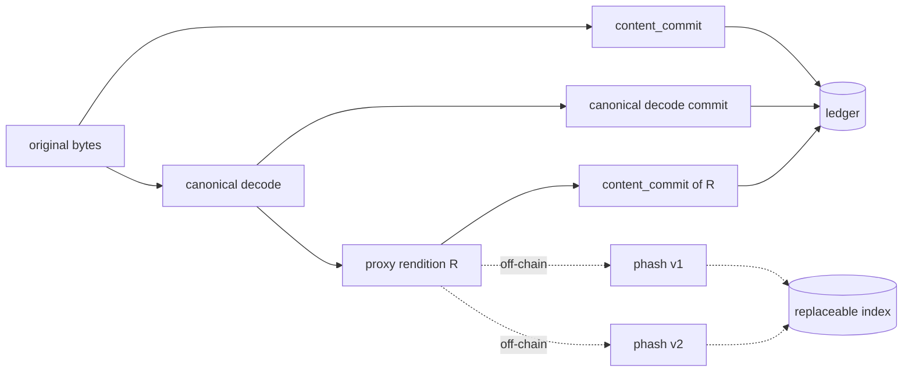

# Robust Identity for Non-Text Works (Design)

**Status:** draft · **nothing on this page is built** · August 2026
**Feeds:** Pillar 2 (binary verification) · NGI Zero Commons milestones — *Threat Model*, *Specification v1.0*

---

## The gap

`content_commit` is exact, and that is correct. An adjudicator holding the bytes must reproduce the
commitment in an arbitrary language years later, and every robustness feature we could add to the
hash is a feature that implementer must also reproduce. Exactness is what makes the commitment
checkable at all.

But exactness has a cost that lands entirely on non-text work. The normal life of a picture on the
internet is re-encoding. A registered PNG is saved as JPEG at quality 85, or resized by a CMS, or
stripped of EXIF by an upload pipeline, and the bytes change completely. The commitment breaks. The
work is orphaned from its own record while remaining, to every human who looks at it, the same
picture.

This is live, not hypothetical. File registration ships today and commits with `content_commit`, so
every image and audio file registered right now carries an identity that dies the first time
anything re-encodes it.

Text mostly escapes this because canonicalisation already absorbs the variation — that is what
canonicalisation is *for*. This document asks what the equivalent move is for pixels and samples,
and how far it can be pushed before it stops being cryptography.

---

## The principle that governs the whole design

> **Ownership up to the point of check-in is cryptographic. Everything past that is litigable.**

The ledger proves that a named key held a specific work at a specific time. That claim is strong,
independently checkable, and does not degrade. It is the product.

What happens to the work *afterwards* — a crop appearing in a dataset, a re-encode on a stock site,
a frame in a model's training corpus — is not a claim the ledger can settle. It is a dispute, and
disputes are settled on evidence by people, not by a Hamming distance.

Two consequences follow, and they decide every open question below.

**The design target is an evidentiary package, not an enforcement mechanism.** We are not building
a system that decides whether infringement occurred. We are building one that lets a creator walk
into a dispute holding a dated, immutable, third-party-verifiable record, plus a reproducible
method for relating a found artifact to it.

**Reproducibility beats accuracy.** A matcher that is 78% accurate and whose result any opposing
party can independently recompute from published algorithms over anchored inputs is worth more in a
dispute than a 95%-accurate proprietary black box. The black box's number is an assertion. Ours has
to be a demonstration. This inverts the usual optimisation target and it is the reason for most of
what follows.

---

## The posture: a ledger of identifiers, not a producer of judgments

Everything below follows from one architectural choice, and it is the choice that makes the rest
safe.

**DAON does not compute fingerprints, evaluate them, or decide which ones are legitimate. It lets a
creator claim any number of identifiers for one work, on one certified ledger, and it certifies
exactly one thing: that this key claimed these identifiers for this work at this time.**

A registration therefore carries a *set* of identifiers, not a distinguished one. An ISCC. A C2PA
soft binding. A Chromaprint. The proxy commitment specified below. A scheme that does not exist
yet. The creator attaches whichever are useful; the ledger holds them together under one entity and
dates them.

This is the same posture the rest of the system already takes. The creator's key signs *"I made
these revisions,"* never *"these are human."* Here it signs *"I claim these identifiers for this
work,"* never *"these fingerprints are correct."* We are not in the business of vouching for
someone else's algorithm, and we should not want to be.

Four things fall out, and they are the reason to prefer this over anything we could design alone:

**Algorithm rotation stops being a problem instead of being managed.** A broken scheme is simply an
identifier nobody queries anymore. Its successor is appended. The ledger is already append-only, so
this needs no new mechanism and no migration — and critically, no record is ever poisoned, because
the ledger never asserted the scheme was sound in the first place.

**The trust boundary lands correctly.** The objection that a client-asserted fingerprint is
unverifiable is answered by refusing the premise rather than engineering around it. The ledger does
not claim to have verified it. It claims a dated, signed assertion exists — which is true, checkable,
and exactly as strong as it sounds.

**Interoperation beats competition.** ISCC and C2PA have ecosystems, standards bodies and adopters.
Being the layer their identifiers anchor *into* is a better position than being a rival scheme, and
it is a much easier thing to ask anyone to adopt.

**It is one less gatekeeping decision.** Choosing which fingerprint schemes are real is a judgment
about legitimacy. Refusing to make it is consistent with refusing every other one.

### What this obliges us to refuse

The posture is only coherent if the refusals are structural rather than documentary:

- **The scheme name is an opaque, namespaced string** — `iscc:v1`, `c2pa:soft:v1`, `iscc:image-norm:v1` —
  and consensus never validates it. Any string is accepted. We may publish a **non-normative** list
  of known schemes as a convenience; it is not a permission list and nothing rejects an identifier
  for being absent from it. The moment something validates the scheme, we are a standards body.
- **We never compute a match.** Two identifiers being equal is a fact anyone can check for
  themselves. Whether that fact means anything is the relying party's problem.
- **We never rank or weight schemes.** No "trusted" tier, no confidence multiplier, no default
  ordering that implies endorsement. Ordering is registration order.

### Asserted is not verified, and the format must say so

The real cost of this design is that the ledger gains a second class of claim. Everything on it
today is self-verifying against content someone holds. An asserted identifier is not — and a
careless reader will conflate the two, especially in a dispute where conflating them is
advantageous.

That distinction cannot live in documentation. It has to be structural: an identifier is tagged as
an assertion in the format itself, and every surface that renders one carries its strength. This is
the match ladder below, applied per identifier rather than per record.

### Two modes, because privacy and discoverability genuinely conflict

An identifier is only useful for third-party discovery if it is public. A public perceptual
identifier is leaky in exactly the way described below. These cannot both be maximised, and the
resolution is not a system-wide default but a per-identifier choice by the creator:

| Mode | On the ledger | Discoverable by third parties | Leaks |
| --- | --- | --- | --- |
| `plaintext` | the identifier itself | Yes | Yes — a lossy rendition of the work, permanently |
| `committed` | `content_commit` over the identifier | No | Nothing until the creator discloses |

`committed` is the default, and the only sane one for unpublished work. `plaintext` is an explicit
choice a creator makes for work that is already out in the world, where discoverability is the
entire point and the leak is moot.

---

## The shape we are rejecting, and why

The obvious design is *dual-state anchoring*: at registration, compute both the cryptographic
commitment and a perceptual hash, write both to the ledger, and let anyone query by Hamming
distance. It is the first design anyone reaches for. It is wrong here for six separate reasons, any
one of which would be disqualifying.

What is rejected is *the system doing this by construction*: a perceptual hash written in the clear
for every registration, treated as authoritative, matched by DAON, and acted on. The posture above
permits a creator to opt one work into a `plaintext` identifier; that is a different act, and each
objection below either does not apply to it or is answered by the creator having chosen it. Where
the difference matters, it is noted.

**A perceptual hash is not hiding.** A DCT-based image hash *is* a low-frequency thumbnail; render
it and you see a blurred version of the picture. An acoustic fingerprint is a decimated
spectrogram. A MinHash over n-grams is a membership oracle — query it enough and you learn the
structure of an unpublished manuscript. DAON does not hold creators' work. Writing perceptual
hashes to a public append-only ledger *by default* would publish a lossy copy of every registered
work, permanently, including drafts. That is not a tuning parameter, it is an inversion of the
promise. A creator publishing one identifier for one already-public work is making an informed
trade for discoverability; the system making it for everyone is making it for people who never
learned there was a trade.

**It is not binding.** The network never sees the bytes, so a perceptual hash has to be computed
client-side and asserted. Nothing lets a verifier check that the perceptual hash and the
`content_commit` came from the same file. Today every commitment on the ledger is self-verifying
against content someone holds, and dual-state anchoring would quietly add a field that is not —
while continuing to present it with the same authority as the rest. The identifier set does not
escape this so much as stop hiding it: tier A is *labelled* an assertion, in the format, and claims
only what it can prove — that someone said this, and when. The defect is not that a field is
asserted. It is a field that is asserted and presented as verified.

**It is adversarially broken, in both directions.** Perceptual hashes are not cryptographic
primitives and have never claimed to be. Apple's NeuralHash was extracted and collided within days
of shipping, and there is a substantial literature on targeted attacks against deep perceptual
hashing. *Evasion* is cheap: the party who wants to train on a work perturbs it until it slides
past the threshold, automatically, at scale — which means the design fails precisely against the
adversary it exists to address. *Collision* is worse: on an open, non-gatekeeping registry, someone
can craft and register fingerprints that collide with many existing works and assert claims over
them. Exact hashing is immune to this. Fuzzy matching over an open registry hands us a squatting
surface we have no mechanism to adjudicate — and by design should not have one.

**Similarity is not derivation.** Two photographers shoot the same sunset. Two performers play the
same public-domain melody. Two screenshots show the same interface. Stock photography exists. A
perceptual match is evidence of resemblance; it is not evidence that one work came from the other.
A ledger that "recognises the asset" and broadcasts rights on that basis is rendering a verdict on
derivation that the mathematics does not support — a similarity score dressed as a determination.
That is the exact failure mode the [non-goals]({{ '/design/provenance-data-model/' | relative_url }})
exist to forbid.

**Perceptual algorithms must be replaceable; ledgers must not.** Every perceptual algorithm has a
shelf life of a few years before someone breaks it. Append-only storage is the worst possible home
for a component with that property. Had NeuralHash been a consensus rule, every record anchored
under it would have been permanently poisoned the week it fell, with no path to repair. This is the
objection the identifier set answers most completely: a versioned scheme name that consensus never
interprets can be abandoned without touching a single existing record, because no record ever
depended on the scheme being sound.

**Perceptual similarity is not an equivalence relation.** A ≈ B and B ≈ C does not give A ≈ C. There
is no canonical cluster representative, so "the ledger recognises the asset" has no well-defined
referent. Registering a fuzzy second identity would reintroduce exactly the multiplicity that
[#147](https://github.com/daon-network/greenfield-blockchain/pull/147) removed, and reintroduce it
non-transitively, which is worse than what we had.

None of this means perceptual matching is useless. It means no perceptual result may be something
the ledger *interprets*. A fingerprint may be recorded as a dated claim by the person making it;
it may not become a fact the system asserts, a match the system computes, or a right the system
determines.

---

## The strategy: normalise the input, then hash exactly

The move that makes this tractable is to stop trying to make the *hash* robust.

Robustness that lives in a fuzzy hash is unverifiable, leaky, unrotatable, and non-transitive.
Robustness that lives in **deterministic canonicalisation of the input** is none of those things —
it stays cryptographic, self-verifying, and hiding, because the output is still an exact hash. It
is just an exact hash of a normalised representation instead of a file.

So: push as much of the robustness as possible into canonicalisation, where it costs nothing in
security posture, and leave only the irreducible remainder to the perceptual layer.

This is not a new philosophy. It is precisely what canonicalisation already does for text — it is
what makes the same words registered through WordPress, an SDK and the API agree — generalised from
markup to pixels and samples. The interesting discovery is how much of the "the hash broke" problem
turns out not to be perceptual at all.

**A large share of real-world breakage is container noise, not perceptual change.** Stripping EXIF,
re-muxing an MP4, changing PNG compression level, rewriting a colour profile, converting stereo to
mono: in these cases the decoded pixels or samples are *bit-identical* and only the wrapper moved.
Hashing the decoded stream instead of the file recovers all of it, exactly, with no fuzziness
anywhere and no change to the verifier's four steps.

---

## The canonical proxy rendition

Canonicalising the decoded stream handles format change. It does not handle rescaling, lossy
artifacts, or cropping. For those we need one more construct.

It sits alongside whatever ISCC, C2PA or Chromaprint values a creator also attaches, and it earns
its place for one reason: it is the only entry in the set that can be *cryptographic* rather than
asserted. Everything else on that list is a third party's algorithm we decline to vouch for. This
one we can anchor.

### Do not invent the reduction — ISCC already specifies it

This was an open question and it is now answered. **We should not define a reduction of our own.**

ISCC's Image-Code normalizes before hashing, and the normalization is fully specified: transpose per
EXIF orientation → white-matte any alpha → crop empty borders → grayscale → resize to 32×32 →
flatten to an array of 1024 `uint8` pixel values. That flattened buffer is a named artifact in the
spec, not an implementation detail.

It is also **exactly 1024 bytes — one `SEGMENT_SIZE`.** So `content_commit` over it is a single
segment: `SHA256(0x03 ‖ buffer)`. No tree, one hash, 32 bytes on the leaf. The construct we needed
already exists, is an ISO standard, and happens to land precisely on our segment size.

The Audio-Code follows the identical pattern: its input is a Chromaprint vector of signed 32-bit
integers, extracted by `fpcalc`, and that vector — not the audio file — is the defined input.

### And here is the gap we actually fill

ISCC draws its conformance boundary *at the normalized buffer*, not at the file:

> "An implementation of the Image-Code algorithm shall be regarded as conforming to the standard if
> it creates the same Image-Code as the reference implementation **for the same 32x32 grayscale
> pixel values**."

Everything before that — decode, transpose, matte, border crop, resize — sits outside the guarantee.
IEP-0004 specifies bicubic interpolation but names no variant, and the spec concedes the
consequence directly:

> "Implementers seeking to guarantee interoperability with each other in these circumstances should
> select the same tool for image pre-processing."

The Audio-Code makes no reproducibility claim from the original file at all; its guarantees begin at
the Chromaprint vector.

So the file → buffer stage is **not** reproducible across implementations, by the standard's own
admission. That is ISCC's weak point, and it is precisely the layer we are built to supply: making
the buffer a **dated, committed artifact of record** means nobody has to argue about which Pillow
version produced it. The disputed step stops being re-derived and starts being disclosed.

This changes what we build from *a competing reduction* to *an anchoring layer plus an upstream
contribution*. The right shape is an IEP proposing pinned pre-processing — a named bicubic variant,
a defined border-crop threshold, a defined alpha matte — with published cross-implementation
vectors. We are not inventing ISCC's reduction. We are completing it, and anchoring the result.

**Honest limit.** Anchoring the buffer does not make file → buffer deterministic; it relocates the
problem to disclosure, where it is tractable. Two honest parties working from different copies with
different tooling may still derive different buffers. This is why tier 2 depends on disclosure (B1)
rather than on independent re-derivation, and why the tier-2 row below carries a caveat.

A **canonical proxy rendition** `R` is a deterministic, published, versioned reduction of the
decoded work to a small fixed-size normalised form — for an image, something like a linear-light
grayscale 64×64 integer buffer. It is derived from the original by a specified algorithm, so anyone
holding the original can recompute it.

The design is then:

- `content_commit(work)` — anchored on the ledger, as today. Exact identity.
- `content_commit(R)` — anchored on the ledger alongside it. Exact identity of the proxy.
- `phash_v(R)` — computed **off-chain**, in a replaceable index, never anchored.

The ledger commits to the *input* of perceptual matching. It never commits to the algorithm.



This buys five properties at once:

| Property | Why it holds |
| --- | --- |
| **Hiding** | The ledger stores `content_commit(R)`, a hash. A 64×64 buffer has ample entropy. Nothing about the work is recoverable from the chain. |
| **Self-verifying** | Anyone holding `R` recomputes its commitment and checks it against the chain. Same four verifier steps, no fifth. |
| **Rotatable** | A broken perceptual algorithm is replaced by re-deriving `phash_v2` from the same anchored `R`. No re-registration, no poisoned records, no consensus change. |
| **Disclosable** | `R` is ~4 KB and is revealed at the creator's choice to a specific counterparty, not published wholesale. |
| **Cheap** | One extra 32-byte field and a fixed-cost derivation at registration. |

The rotation property is the one that makes the whole approach defensible. It converts "we
permanently baked a breakable algorithm into an append-only ledger" — the fatal objection to
dual-state anchoring — into "we anchored a stable normalised input, and the algorithm is a
detail of whoever is searching."

---

## The match ladder

The marriage of the two identities is not one link. It is a ladder, and three of its four rungs are
still exact cryptography.

| Tier | Name | What a match proves | Basis | May be stated as fact |
| --- | --- | --- | --- | --- |
| 0 | **Anchored** | The same bytes. | `content_commit(work)` | Yes |
| 1 | **Canonically identical** | The same decoded stream: a different container or encoding of the same pixels or samples. | commit over canonical decode | Yes |
| 2 | **Proxy match** | The same work after rescaling or lossy re-encoding, to the tolerance the proxy defines. | `content_commit(R)` | Yes, with the caveat below |
| 3 | **Perceptual candidate** | Resemblance at distance *d* under algorithm *v*. Nothing more. | off-chain index | **No** |
| A | **Asserted identifier** | That this key claimed this identifier for this work at this time. Nothing about whether the identifier is correct. | signed identifier set | Only as an assertion |

Tier A sits outside the ladder rather than on it, because its strength is a property of a scheme we
deliberately do not vouch for. What DAON certifies about a tier-A identifier is the *claim* and its
*date* — both of which are exactly as verifiable as anything else on the ledger. What the identifier
means is between the relying party and whoever specified the scheme.

Tier 2 is the quiet win. A re-encode that changes every byte and every decoded sample can still
land on a bit-identical proxy, and that is an exact hash match — a cryptographic statement about a
lossily-transformed file. It covers a large part of what people reach for perceptual hashing to do,
without inheriting any of perceptual hashing's problems.

**The tier-2 caveat, stated plainly.** Tier 2 is exact *given an agreed buffer*. Because the file →
buffer stage is not reproducible across implementations (see above), two honest parties using
different tooling may derive different buffers from the same picture and see no match. Tier 2 is
therefore reliable within one pinned implementation and on disclosure; across arbitrary
implementations it degrades toward tier 3. Pinning the pre-processing is what raises it, and until
that is pinned and vectored, tier-2 claims must be made on disclosed buffers rather than
independently re-derived ones.

**Normative.** Tiers 0–2 are determinations and may be presented as such. Tier 3 is a candidate and
must never be rendered as a determination, in any interface, endpoint, notification or export. The
permitted shape is *"candidate registration, distance d, algorithm v, terms declared at time T —
the relying party decides."* The prohibited shape is *"this asset is registered to X"* on tier-3
evidence alone.

---

## Canonicalisation per modality

Every step below is a determinism hazard before it is a robustness feature. Any operation involving
floating point risks two conforming implementations disagreeing in the low bit, which would break
the commitment for honest parties — a far worse failure than missing a match. **Where a choice
exists, prefer the integer operation with the worse robustness.**

### Still images

Adopt ISCC's pipeline verbatim rather than a cleaner one of our own:

```
transpose per EXIF orientation → white-matte alpha → crop empty borders → grayscale
       → resize to 32×32 (bicubic) → flatten to 1024 uint8 values
```

**This reverses the preference stated above, deliberately.** A box filter would be more reproducible
than bicubic, and an earlier draft of this page specified one. Interoperability wins: a reduction
that agrees with the ISO standard is worth more than a reduction that is marginally easier to
reproduce and agrees with nothing. What we contribute is pinning the parts ISCC leaves open — the
bicubic variant, the border-crop threshold, the matte definition — not replacing its choices.

*Absorbed exactly (tier 1–2):* metadata and EXIF changes, container swaps, lossless re-encode,
orientation-by-metadata, alpha representation, resolution changes, mild lossy compression.

*Not absorbed — needs tier 3:* cropping, true rotation, flips, heavy compression artifacts, colour
grading, overlays and watermarks.

*Crop resistance* is worth a specific mechanism rather than surrendering to tier 3. Deriving proxies
over a grid of overlapping sub-regions and anchoring them via `content_commit_parts` turns "is this
a crop of the work" into "does the crop wholly contain one anchored tile," which is again an exact
match. It costs one commitment per tile and it is the single highest-value extension here.

### Audio

Same principle — the anchorable artifact is ISCC's defined input, not one of ours:

```
decode → Chromaprint fingerprint (fpcalc -raw -signed -length 0) → vector of int32
```

The vector is what gets anchored. The unpinned stage is decode → Chromaprint, which depends on
`fpcalc` version and decoder behaviour, and needs the same treatment as image pre-processing.

*Absorbed exactly:* bitrate and codec changes, container swaps, channel layout, gain and
normalisation, sample-rate conversion.

*Not absorbed:* time-stretch, pitch shift, EQ, overlaid noise, and — the hard one — **excerpting**.
A thirty-second clip of a four-minute track shares no proxy with it. Excerpt detection is
structurally a different problem and belongs in the index layer, where landmark/constellation
fingerprinting handles it well. Do not try to solve it in the anchored proxy.

### Video

The hardest case and the one to defer. Video is a sequence of image problems, plus an audio
problem, plus a temporal problem, and the canonicalisation surface — frame-rate resampling,
letterbox removal, colour subsampling — is where determinism is most likely to fail across
implementations. Sketch only: fixed-rate keyframe sampling into a grid of image proxies plus a
temporal signature. **Scope images and audio first and let video learn from what breaks.**

### Vector art, 3D, code

Vector art is closer to the text problem than the image problem — canonicalise the markup. Meshes
need their own normalisation (canonical vertex ordering, scale and translation normalisation)
before any of this applies. Neither is in scope here; both are noted so nobody assumes the image
pipeline covers them.

---

## Binding: how tightly can the two identities actually marry?

This is the crux, and the honest answer is *three levels, of increasing strength and cost*.

**B0 — Co-signed assertion.** The creator computes work commitment and proxy commitment together
and signs both into one record at one moment. The binding is the signature and the timestamp. A
liar can pair a proxy with a work it did not come from — but the lie is dated, immutable, signed,
and refutable the moment the work is disclosed. It is an *accountable assertion*: not verified up
front, but self-incriminating if false. Given the litigable framing, this is a reasonable MVP.

**B1 — Proxy disclosure.** The working mechanism for an actual dispute. The creator discloses `R`
to a specific counterparty, who recomputes `content_commit(R)`, checks it against the chain,
computes the perceptual distance to the artifact in question *themselves*, and reaches their own
conclusion. Nothing is taken on trust and no DAON service is in the loop. This is the same
disclosure discipline as segment proofs: the holder generates it, from content only they have.

**B2 — Zero-knowledge binding.** Prove that `R` is the canonical reduction of the same bytes that
produced `content_commit(work)`, without revealing the bytes. This is research, not roadmap — but
the proxy design makes it *dramatically* more tractable than the naive version. The statement to
prove is ISCC's normalization — a bicubic downsample to 32×32 — and a SHA-256 over the resulting
1024 bytes, which is a single segment. It is data-parallel, deterministic,
and contains no neural network, because the neural part was pushed off-chain where it belongs. A
ZK proof over NeuralHash is not happening this decade; a ZK proof over "this 64×64 buffer is the
box-downsample of the committed content" is a well-shaped research target.

---

## Format impact

Deliberately small. One new tag, one new leaf field, and no change to the verifier's four steps.

The leaf is fixed-width with no optional fields, so a *set* of identifiers must collapse to a single
32-byte commitment. It does, the same way parts already do:

```
tag::IDENTIFIER = 0x05

identifier(i)          = scheme ‖ 0x00 ‖ mode ‖ value
                         scheme : opaque namespaced UTF-8, never validated  ("iscc:v1")
                         mode   : 0x00 = committed, 0x01 = plaintext
                         value  : content_commit(identifier_bytes)  when committed
                                  identifier_bytes                  when plaintext

identifier_leaf(i)     = SHA256( 0x05 ‖ identifier(i) )
identifier_set_commit  = merkle_root([ identifier_leaf(i) for i in set ])
```

An empty set is one empty identifier, mirroring `segments` and `content_commit_parts` on empty
input. Order is registration order and carries no meaning.

**The `0x05` tag is load-bearing, not decoration** — for the same reason `0x04` is. Without domain
separation an identifier commitment and a work commitment are the same 32 bytes, and either could
be presented as the other. Since identifiers are *asserted* and work commitments are *verified*,
that confusion is precisely the one that must be impossible: it would let someone claim tier-0
identity on evidence that was never checked by anyone.

**The set is a Merkle root, so disclosure is selective.** A creator proves one identifier with an
inclusion proof without revealing which others they registered. This matters more than it looks: the
set of schemes a creator uses is itself information about them, and revealing "I also anchor a C2PA
soft binding" to answer a question about an ISCC is a disclosure nobody asked for.

Tiled proxies compose through the existing `content_commit_parts`. No new tree construction.

---

## Threat model

| Attack | Mitigation | Residual risk |
| --- | --- | --- |
| **Evasion** — perturb the work to escape the threshold | Tiers 1–2 are exact and cannot be evaded by re-encoding alone; evasion must visibly degrade the work to defeat tier 2 | Real. A determined adversary defeats tier 3. Disclose this; do not claim otherwise. |
| **Collision squatting** — register fingerprints colliding with many works | Nothing fuzzy is on the ledger, so there is no on-chain claim to squat; tier 3 lives in an index that renders no verdict | Index-level noise, not a rights claim |
| **False proxy** — pair a proxy with a work it did not come from | B0 makes it signed and dated; B1 exposes it on disclosure | Undetected until challenged. B2 closes it. |
| **Corpus reconstruction** — harvest proxies to rebuild works | Proxies are never published; only their commitments are | Disclosed proxies leak a 64×64 rendition to that counterparty, by the creator's choice |
| **Index poisoning** — flood the off-chain index | Index is replaceable and non-authoritative; rebuild from anchored proxies | Availability, not integrity |
| **False identifier** — claim an identifier belonging to someone else's work | Signed, dated, refutable on disclosure; the ledger never asserted it was checked | Real, and multiplied by set size. The answer is that a false claim is evidence against the claimant, not that it is prevented. |
| **Scheme confusion** — two parties use one scheme name for different constructs | Namespacing convention; domain-separated leaves | Open (question 6) |
| **Determinism drift** — two implementations disagree on `R` | Integer-only operations, pinned filters, published test vectors | The most likely real failure. Vectors are mandatory, not optional. |

---

## Non-goals — hard boundaries

Consistent with the segment-disclosure rule, which DAON supports in the format and refuses to serve
as an endpoint:

- **DAON does not operate a public perceptual search over creators' proxies.** The format supports
  tier-3 matching; DAON serving a "find works resembling this" endpoint over the registry would
  turn a creator's registration into a lookup service others mine. If such an index exists it is
  opt-in, per work, and the creator chooses to be in it.
- **Proxy anchoring is opt-in per work, and unpublished drafts default out.** The privacy argument
  against on-chain perceptual hashes applies with reduced force to commitments, but "reduced" is
  not "none," and a draft is exactly the case where the creator has the most to lose.
- **No tier-3 result is ever a determination**, is ever exported as one, or ever gates anything.
- **No similarity score is rendered to third parties as a property of the work.** A distance is a
  fact about a comparison, not a fact about the work, and a number attached to a work is a purity
  score no matter what we call it.
- **DAON never validates, ranks, endorses or rejects an identifier scheme.** No trusted tier, no
  confidence weighting, no allow-list enforced by consensus. A published list of known schemes is a
  convenience and never a permission.
- **DAON never computes a fingerprint on a creator's behalf as a condition of registration.** We may
  ship tooling that does it locally; the ledger must accept a registration carrying no identifiers
  at all, forever. A registry that works better for people who submit more fingerprints is a
  registry that has started grading them.

---

## Open questions

Genuinely unresolved, and the honest content of a research proposal:

1. **Verifiable binding without disclosure** (B2). What is the real cost of a ZK proof over the
   canonical reduction, at what proxy resolution, on consumer hardware?
2. **Cross-implementation determinism.** Confirmed as a real defect, not a hypothetical: ISO 24138
   guarantees conformance only from the normalized buffer onward and tells implementers to "select
   the same tool" for everything before it. Can that stage be pinned tightly enough — named bicubic
   variant, border-crop threshold, matte — that independent Rust, TypeScript and Python
   implementations agree bit-for-bit? If not, tier 2 is permanently disclosure-only. Measure the
   actual divergence rate across tooling before assuming either outcome.
3. **Proxy resolution against reconstruction.** How large can `R` be before a disclosed proxy is
   itself a meaningful copy? Where is the knee between match quality and leakage?
4. **Excerpt anchoring for audio.** Is there an anchored construct for excerpts, or is excerpting
   irreducibly tier 3?
5. **Threshold semantics under an adversary.** What false-positive rate is defensible when the
   corpus is the internet and the comparison count is astronomical?
6. **Scheme namespacing without governance.** If any string is a valid scheme, two implementers can
   pick the same name for different things, or different names for the same thing. Is there a
   namespacing convention that makes collisions self-evident without anyone administering a
   registry? This is the hardest consequence of refusing to be a standards body and it does not
   have an obvious answer.
7. ~~Whether the proxy is worth specifying at all.~~ **Resolved — see "Do not invent the
   reduction" below.** ISCC already specifies it. What remains open is narrower: can the
   pre-processing stage be pinned tightly enough, and is upstream willing to take the pin?

---

## Prior art — read before implementing

This space is well-trodden and we should not reinvent it.

- **ISCC — ISO 24138:2024.** Confirmed. A composite identifier built from units: Meta-Code,
  Semantic-Code, Content-Code and Data-Code are similarity-preserving; **Instance-Code** is the
  cryptographic one — a BLAKE3 Merkle root over 1024-byte chunks, supporting containment proofs and
  verified streaming. That is structurally the same construct as `content_commit`, arrived at
  independently for the same reason. Different hash and tree construction, so not interchangeable,
  but the shape and the rationale match.
- **C2PA / Content Credentials** — the `c2pa.soft-binding` assertion carries `alg`, `value`,
  `scope` and `alg-params`. The algorithms themselves are *not* specified by C2PA; they live in an
  externally maintained Soft Binding Algorithm List. There is no normalized rendition in the
  assertion and no commitment over one. C2PA is a container for asserted opaque values — tier A
  exactly, and nothing above it.
- **Content ID** — read for its false-claim and abuse record, which is the empirical case for the
  tier-3 boundary, not for its design.
- **Chromaprint / AcoustID**, and the Shazam landmark paper — audio fingerprinting, including the
  excerpt case.
- **MinHash (Broder), SimHash (Charikar)** — text near-duplicate detection.
- **"Learning to Break Deep Perceptual Hashing" (FAccT 2022)** and the NeuralHash collision work —
  the adversarial literature behind the rejection above.
- **Multi-index hashing, HNSW/FAISS** — the search layer, if we build an index at all.

---

## What to build first

In order, and each is useful alone:

1. **The identifier set and `0x05`.** Tier A. This is first because it is the cheapest thing on the
   list, needs no image or audio pipeline at all, and immediately lets a creator anchor an ISCC or a
   C2PA soft binding they already have. It is also the piece that ages best: it is useful before we
   have decided anything about proxies, and it stays useful if we decide never to build one.
2. **Canonical decode + commitment for images and audio.** Tier 1. No new concepts, no fuzziness,
   recovers container-noise breakage, and is the largest gain per unit of risk on this page.
3. **Published test vectors for the canonical pipelines**, cross-checked between Rust and
   TypeScript, exactly as `content_commit` is pinned today. If determinism fails, it fails here,
   cheaply.
4. **Anchor the ISCC normalized rendition** — `iscc:image-norm:v1`, and the Chromaprint vector for
   audio. Tier 2, opt-in. Not a construct of ours; 1024 bytes for images, so one segment and one
   hash. In parallel, draft the IEP pinning ISCC's pre-processing stage, since that is what raises
   tier 2 from intra-implementation to general.
5. **Tiled proxies for crop resistance.**
6. Only then, and only if something needs it: an off-chain tier-3 index — opt-in, replaceable, and
   rendering candidates rather than verdicts.

The ordering is deliberate. Step 1 makes DAON useful to every fingerprinting ecosystem that already
exists without committing us to a single technical bet, and every later step is an improvement to
one entry in a set rather than a change to the architecture.
