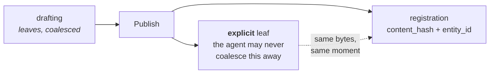
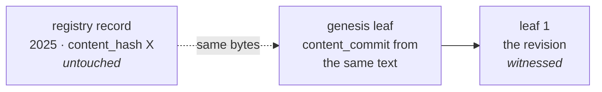

# Publication and Versions — When a Hash Happens

**Status:** design proposal · **Companion to:** [`registry-and-provenance.md`](./registry-and-provenance.md), [`editor-integration-spec.md`](./editor-integration-spec.md), [`document-formats.md`](./document-formats.md)

Two things can be recorded about a work, at wildly different rates:

| | Rate | Cost | Says |
| --- | --- | --- | --- |
| **A leaf** | continuous — every save, coalesced | local disk, one Merkle level | this key held this content at this time |
| **A registration** | rare — publication milestones | a registry row, a blockchain write | DAON recorded this hash by this date |

Getting the rates wrong in either direction is the failure mode. Register on every save and the
registry becomes a write-heavy log of nothing. Leave everything until publication and you throw
away the months of priority that make the claim worth having.

**The rule: leaf constantly, register deliberately.**

---

## What connects them

Nothing is stored. Both values derive from the same bytes, so anyone holding the content computes
both and checks both.

This is worth stating flatly because it looks like something is missing:

> `content_commit` is only checkable by someone holding the content. Anyone holding the content
> can compute `content_hash` for free. **There is no verifier who can check one and not the
> other**, so a pointer between them would add nothing that holding the content does not already
> give you.

Consequently the database association is a **finding aid, not evidence.** Tamper with the row,
drop the table, restore a bad backup — the check still works, because it runs on content, not on
our records. A loose association is not a compromise here; tightening it would buy nothing.

---

## Path A — a native editor

The creator drafts. The agent coalesces and appends leaves continuously, batches heads, witnesses
against Bitcoin. **None of this reaches DAON.**

The creator presses **Publish**. One action, two artifacts, from the same bytes at the same
instant:

Publish rather than "cut draft" is the cleaner trigger, and it gives the result worth wanting:
**one registry hash for the version people will actually encounter**, sitting on top of months of
witnessed drafting.

`reason: "explicit"` already exists for this. `editor-integration-spec.md` §4 describes it as
*"the version going to a committee, the state submitted to a publisher"*, and it is the one reason
the agent may never coalesce away.

---

## Path B — a platform, as broker

Serialised publication: a chapter goes up, then another, fifty times, then the work is marked
complete.

**Do not register fifty times.** But do not wait, either — and this is the part that is easy to
get backwards.

If chapter 1 goes up in January and is lifted in March, the proof that matters is January's.
Waiting until the work completes in December throws away eleven months of priority for nothing.

So: **every chapter is a leaf; the registration happens once, on completion.** The leaves carry
the incremental claim, and segment proofs let a creator show chapter 1 was in their January
version without revealing chapters 2–50. The registration is the whole-work claim, standing on
eleven months of witnessed history rather than replacing it.

The platform acts as a **broker**: it holds no keys the creator does not have, and its role is to
grant the registration at completion. This is what the broker system exists for, and it is the
honest arrangement — the platform is attesting what it observed, on infrastructure it runs.

### Where the leaves live

Ideally the creator keeps their own chain, in whatever they write with. Until that is common, a
platform holding it on their behalf is a real service — with the custody caveat from
[`key-recovery.md`](./key-recovery.md) attached: a chain the platform can sign is a chain the
platform controls, and leaving the platform should not mean leaving the history behind.

---

## What the registry should record

Two columns, no format change:

| Column | Holds |
| --- | --- |
| `entity_id` | the chain's genesis leaf hash |
| `head_at_registration` | the head the creator presented when registering |

`entity_id` is a better identity than a title. A title is a string someone typed; the entity is
the genesis leaf's hash, ordered and un-rewritable by construction.

**These are recorded, not asserted.** DAON writes down what the creator presented. Whether that
chain really covers this content is checkable by anyone holding it, and the certificate must say
which of the two it is. If the creator also submits a proof — leaf, inclusion proof, witness
attestation — DAON can run the four-step verifier and record that it checked, which is a stronger
and still honest claim.

### Registrations are append-only

There is no `PUT` on content, no `UPDATE protected_content`, and re-registering an existing hash
returns *already protected* rather than mutating. **Keep it that way.** Updating a record's hash
in place would destroy its original date, which is the only thing that registration was ever for.

A new version is a new row with `previous_version` pointing back — never an edit.

---

## Adopting a registration that predates all of this

Most registrations have no chain. This is how they get one, and it needs no account, per
[`registry-and-provenance.md`](./registry-and-provenance.md).

**Worked example.** A creator registered a story on the app in 2025 by pasting the text into the
form. They have since revised it.

1. **Genesis the chain on the version that was registered** — the exact text that produced the
   existing hash. Its `content_commit` now derives from the same bytes as that registration, so
   the two are provably about one work.
2. **The revision becomes leaf 1**, witnessed like any other.
3. **The 2025 registry record is untouched.** It keeps its original date, which is the valuable
   part.

**The practical crux is whether the creator still has the exact file.**

- **Yes** → genesis on it, and both records join.
- **No** → the old registration stands alone as a dated claim and the chain starts from what they
  have now. Two facts, no cryptographic join between them. Diminished, not lost.

**Does the revision need its own registration?** Only if it is the version people will encounter.
Then register it too, with `previous_version` pointing back: two dated registry claims, one chain
linking them. For an ordinary revision, a leaf is enough — it is already witnessed.

### A note on old hashes and canonicalisation

Hashing now strips markup and folds line endings ([`document-formats.md`](./document-formats.md)).
Text pasted into the app's form is unaffected: the browser hands back an API value with LF
newlines and no markup, so those hashes are identical under both algorithms.

Registrations made over HTML or CRLF do change, which is why verification accepts the legacy hash
as well as the canonical one. Content is not stored, so there is no way to identify or migrate
them — only to keep accepting both.

---

## Retire the dormant version mechanisms

Four half-built answers to this question already exist. **Before adding a fifth, decide which one
wins.**

| Mechanism | State | Proposed |
| --- | --- | --- |
| `revision_history` on-chain | a bare `repeated string`, no Merkle, no witnesses, no signatures | **leave dead.** Already ruled a fossil; removing it is a chain migration for no benefit |
| `previous_version` column | written on insert | **keep**, narrowed to what it is good at: linking registry rows in order |
| `getVersionHistory()` recursive CTE | fully implemented, **no endpoint calls it** | **wire or delete.** Useful for listing a work's registrations; must not be presented as a revision history |
| `content_versions` table | exists, **no code touches it** | **drop.** It duplicates `previous_version` and has never held a row |
| `normalized_hash` column + index | exists, never written or read | **drop or use.** An index costing writes and serving nothing |

**The provenance chain is the version history.** It is ordered, signed, witnessed and cannot be
rewritten; the registry's chain of `previous_version` rows is none of those. The registry should
record *which registrations exist and in what order*, and stop implying it knows how a work
evolved.

`registry-and-provenance.md` already says two histories that can disagree is worse than one. There
are currently four.

---

## What a certificate should show

Today's certificate renders registry fields only — `contentHash`, `timestamp`, `license`,
`txHash`, `height` — with no mention of revisions. A reader cannot see both claims, let alone
check the join.

It should present them side by side, as separate claims from separate anchors:

> **Registry.** DAON recorded hash `38d1…` on 14 March 2026. Anchor: DAON's chain.
>
> **Provenance.** Entity `861b…`, 412 revisions between Nov 2025 and Aug 2026, signed throughout
> by one key, witnessed against Bitcoin blocks 770,142–801,995. Anchor: Bitcoin.
>
> **The join.** Both derive from content you hold. Hash your file to check either.

**The certificate must not assert the two are the same work.** It shows two checkable facts and
how to check them. Concluding that they describe one work is the reader's step, and taking it for
them would make DAON the adjudicator this design refuses to become.

---

## Open

- **Whether DAON verifies a submitted proof or merely records what it was told.** Verifying is
  strictly better and the verifier already exists; it means accepting chain data at registration,
  which is a creator's affirmative act rather than agent egress. Probably yes, and it needs
  deciding rather than drifting.
- **What a broker may hold on a creator's behalf.** A platform that can sign is a platform that
  controls the chain. The custody rules in `key-recovery.md` were written for employers and apply
  unchanged.
- **Whether `entity_id` on a registration creates an aggregation surface.** It groups the
  registrations of one work, which is narrow and useful. It does not link a creator's separate
  works, since that would need the author key, which is never stored. Worth confirming that
  boundary holds before building.
