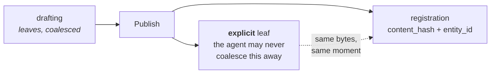
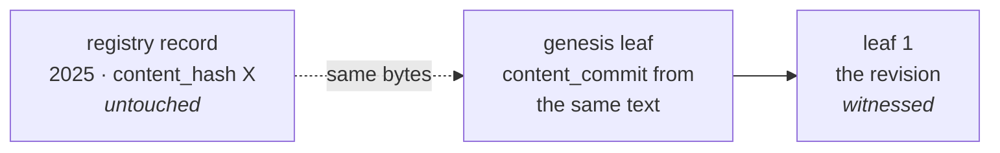

# Publication and Versions — When a Hash Happens

**Status:** design proposal · **Companion to:** [`registry-and-provenance.md`](./registry-and-provenance.md), [`editor-integration-spec.md`](./editor-integration-spec.md), [`document-formats.md`](./document-formats.md)

Two things can be recorded about a work, at wildly different rates:

| | Rate | Cost | Says |
| --- | --- | --- | --- |
| **A leaf** | continuous — every save, coalesced | local disk, one Merkle level | this key held this content at this time |
| **A registration** | rare — publication milestones | a registry row, a blockchain write | DAON recorded this hash by this date |

Getting the rates wrong in either direction is the failure mode. Register on every save and the
registry becomes a write-heavy log of nothing. Leave everything until publication and you throw
away the months of priority that make the claim worth having.

**The rule: leaf constantly, register deliberately.**

---

## What connects them

Nothing is stored. Both values derive from the same bytes, so anyone holding the content computes
both and checks both.

This is worth stating flatly because it looks like something is missing:

> `content_commit` is only checkable by someone holding the content. Anyone holding the content
> can compute `content_hash` for free. **There is no verifier who can check one and not the
> other**, so a pointer between them would add nothing that holding the content does not already
> give you.

Consequently the database association is a **finding aid, not evidence.** Tamper with the row,
drop the table, restore a bad backup — the check still works, because it runs on content, not on
our records. A loose association is not a compromise here; tightening it would buy nothing.

---

## Path A — a native editor

The creator drafts. The agent coalesces and appends leaves continuously, batches heads, witnesses
against Bitcoin. **None of this reaches DAON.**

The creator presses **Publish**. One action, two artifacts, from the same bytes at the same
instant:



Publish rather than "cut draft" is the cleaner trigger, and it gives the result worth wanting:
**one registry hash for the version people will actually encounter**, sitting on top of months of
witnessed drafting.

`reason: "explicit"` already exists for this. `editor-integration-spec.md` §4 describes it as
*"the version going to a committee, the state submitted to a publisher"*, and it is the one reason
the agent may never coalesce away.

---

## Path B — a platform, as broker

Serialised publication: a chapter goes up, then another, fifty times, then the work is marked
complete.

**Do not register fifty times.** But do not wait, either — and this is the part that is easy to
get backwards.

If chapter 1 goes up in January and is lifted in March, the proof that matters is January's.
Waiting until the work completes in December throws away eleven months of priority for nothing.

So where a chain exists: **every chapter is a leaf, and the registration happens once, on
completion.** The leaves carry the incremental claim, and segment proofs let a creator show
chapter 1 was in their January version without revealing chapters 2–50. The registration is the
whole-work claim, standing on eleven months of witnessed history rather than replacing it.

### Leaves require an agent, and most writers will not have one

That last paragraph assumes tooling, which is a large assumption. **Leaves are produced locally by
software the creator runs.** A writer serialising on a platform with nothing else installed has no
chain at all — DAON's involvement begins when a root arrives, and until then there is nothing to
arrive.

Three honest tiers:

| The writer's situation | What they get |
| --- | --- |
| Platform only, no agent | A registration on completion. A real dated claim, and **no revision history** |
| Their own tool runs an agent | A leaf per chapter, held locally, plus the registration |
| The platform runs an agent for them | Leaves — but the platform holds a signing key |

The platform acts as a **broker** for the first tier: it holds no key the creator does not have,
and its role is to grant the registration at completion. That is the honest arrangement, and it is
what the broker system exists for.

The third tier is the one to be wary of. `key-recovery.md` § *Custody domains* applies verbatim
with "platform" substituted for "employer": **a chain someone else can sign is a chain someone
else controls**, and leaving a platform must not mean leaving the history behind. If it is offered
at all, the recovery key must never be in the platform's custody.

---

## What the registry should record

An **appended association record**, not columns on the registration:

```
association: (content_hash, entity_id, head, asserted_by, verified, recorded_at)
```

`entity_id` is better identity than a title. A title is a string someone typed; the entity is a
genesis leaf hash, ordered and un-rewritable by construction.

### Why appended and not a column

The main use of this is **adoption** — a registration from 2025 gaining a chain in 2026. Adding
columns to that row means editing a record whose entire value is that it has not been edited since
2025. That contradicts the append-only rule two sections below, and it would quietly destroy the
thing registration exists to provide.

So the original row is never touched. Associations accumulate beside it, and the accumulation is
itself truthful:

```
2025  registration:  content_hash X, date T          ← never modified
2026  association:   X → entity E, head H₁, recorded 2026-08
2027  association:   X → entity E, head H₂, recorded 2027-02
```

That reads as *"in August they told us the head was H₁; in February, H₂"* — a history of what DAON
was told, which is a fact DAON is entitled to keep.

### Associations must not be exclusive

**Normative.** Any number of associations may attach to one `content_hash`, from any number of
accounts, and none displaces another.

This is the requirement that makes impersonation survivable. If a hash accepted only one root,
whoever asserted first would squat it — and the person best placed to do that is not the creator.
With many allowed, a false assertion sits next to the true one and loses on evidence.

Consequences, all required:

- **Attributed.** Each association names the account that made it, and magic-link auth means that
  mailbox is verified. Attribution is the accountability mechanism, not adjudication.
- **Dated and append-only.** A later assertion never erases an earlier one.
- **Never ranked by DAON.** Competing assertions are shown; deciding between them is a job for a
  forum with standing, exactly as with competing chains in
  [`registry-and-provenance.md`](./registry-and-provenance.md).

A false association is also largely self-refuting: anyone holding the content computes
`content_commit` and sees the claimed chain does not commit to it. And an attacker who *does* hold
the content is the ordinary competing-claim case, where earlier witnessed history wins.

### A key change needs the owner of record to say yes

**Normative.** An association whose chain carries **different keys** from the last association for
that content is recorded as **pending**, and does not become DAON's current answer until the
**owner of record** attests to it.

An association that merely advances the head — same keys, more leaves — needs no attestation. That
is a chain being extended, which is what chains do.

#### Why this gate and not the other one

Requiring the *previous asserter's* consent would be a mistake, and a tempting one. It hands
whoever asserted first a veto over everyone after, which is the squatting problem inverted: a false
assertion on Monday would stop the real creator recording their own on Tuesday.

The **owner of record** is a different gate entirely, and it is one DAON is entitled to apply,
because it is the only thing here DAON is actually authoritative for. Recording an assertion is
permissionless; changing what DAON says about ownership is not.

#### What it does and does not do

It does not stop the rotation. The chain rotated on someone's machine, signed by a key DAON does
not hold, and is witnessed against Bitcoin whatever happens here. **DAON's record lagging the chain
is the correct outcome**, not a bug: the record says what DAON was told and accepted, never what
the chain contains.

What it buys is that a stolen chain cannot quietly become DAON's answer for a work whose owner is
sitting right there with an email address.

#### Attestation is the only thing that can decide this

DAON can check a rotation cryptographically, given the leaf, its signature, the parent and a
witness. That proves the change was **authorised by the key on file** — and a stolen key *is* the
key on file. A thief's rotation verifies perfectly.

So verification answers *"was this authorised by the recorded key?"* and never *"is this person the
owner?"* Only the second question decides whose record this is, and only a human with the account
can answer it. **There is no other way**, which is why the attestation is not a fallback for when
verification is unavailable — it is the mechanism, and verification is a separate, weaker check
that runs alongside.

The one exception is not an exception: when the asserter **is** the owner of record, asserting is
attesting. Nothing else substitutes.

#### Pending, then expired

The assertion is written immediately with `status = 'pending'`, because the date it was made is
evidence and discarding it would destroy that. It simply is not current until attested.

```
2026-08-17  association asserted   head H₂, keys differ   → pending
2026-08-17  notice emailed to the owner of record
2026-08-22  attested  → current      (or)  disputed → recorded, still not current
```

Three outcomes, all appended, none erasing anything:

| Owner does | Result |
| --- | --- |
| Attests | the association becomes current |
| Disputes | recorded as disputed, dated and attributed; never becomes current |
| Nothing, for five days | **expires** — refused, and the record is unchanged |

**Silence refuses.** It is the only reading that cannot be exploited by waiting: if silence
accepted, an attacker's best move would be to assert against someone on holiday and say nothing.
An expired request stays on the record, dated, because that it was made is a fact — it simply never
became DAON's answer.

Five days is the same number the chain-level delay used before that rule was removed, and it is
doing a different job here: not "time to counter-rotate" but "time to read an email".

#### When there is no owner of record

Some content has none — the reindexed records whose `user_id` was lost, and anything registered
anonymously. There is nobody to ask, so the association is recorded and marked as never attested.
That is weaker, and it is honest: an unattested claim about content nobody has claimed is exactly
as strong as it sounds.

### Recorded, or verified

`verified` distinguishes two very different claims, and the certificate must render them
differently:

| | DAON's claim |
| --- | --- |
| **Recorded** | "this account told us the head was H on this date" |
| **Verified** | "we checked, and it holds" |

Recorded is still useful — H is a commitment, so a dated record of it pins the chain state as of
that date even though DAON could not check it then.

Verification splits by what is being checked:

- **The chain is real and witnessed** — leaf, inclusion proof and witness attestation are enough.
  **No content needed.** DAON can run the four-step verifier on submitted proof alone.
- **The chain is about this registration** — requires the content, because the join is
  `content → content_commit`.

### Registrations are append-only

There is no `PUT` on content, no `UPDATE protected_content`, and re-registering an existing hash
returns *already protected* rather than mutating. **Keep it that way.** Updating a record's hash
in place would destroy its original date, which is the only thing that registration was ever for.

A new version is a new row with `previous_version` pointing back — never an edit.

---

## Who keeps the content

Verifying the join needs content. Keeping content is a much larger decision than it appears, so
the two are separated deliberately.

### Verify, then discard

DAON already **receives** content — `/api/v1/protect` takes it in the body and hashes it. The
question is only whether to **store** it.

Storing it is the single largest change to the threat model in this system. Today a breach or a
subpoena yields hashes, which read as nothing. Holding content makes DAON subpoenable and
breachable for the material itself — and the most common thing a creator registers is an
unpublished draft they specifically do not want seen. It also moots the segment-disclosure design,
which exists so a creator can prove one passage without exposing the pages around it.

**So: verify at submission, then discard.** Compute `content_commit`, check it against the genesis
leaf, record `verified`, drop the content. Verification is a moment rather than a retention
commitment.

Retention survives as an **opt-in backup**, labelled as what it is. It should never be a silent
consequence of registering, because it is a **one-way door**: storage can be added later, but
content already breached or already subpoenaed cannot be un-stored.

### The creator must end up holding exactly what was hashed

Discarding shifts a burden onto the creator, and the two paths bear it very differently.

**The agent should do it invisibly** — and today it cannot. `Store::put_content` writes each 1 KiB
segment keyed by its hash and returns the Merkle root, but **nothing records the ordered list of
segment hashes**. Every blob is present and the recipe for reassembling them is not, so the agent
can prove content it is handed and cannot hand it back. A per-leaf manifest fixes it, and until
then "the agent keeps your content" is not true.

**The app must hand the bytes back.** At registration it should return the exact canonical text as
a download, named for its hash so the file is self-identifying in a folder, with plain advice to
keep it.

This is not a convenience. Since hashing canonicalises — markup stripped, line endings folded —
**the bytes hashed are not necessarily the bytes the creator pasted**, so even a diligent user who
saved their own copy may be unable to reproduce the hash.
[`document-formats.md`](./document-formats.md) already requires this and it is unimplemented:

> The app must not extract the text and register it on the creator's behalf without saying so. The
> artifact registered has to be one the creator holds and can produce later, **and a file only
> DAON ever saw is not that.**

A creator who declines the download still has a dated hash. That is a weaker position and a
visible choice, which is the right trade.

### Binary is a different mechanism, not a bigger limit

`/api/v1/protect` validates `content` as a **string**, capped at 10 MB, matching
`express.json({ limit: '10mb' })`. For text that ceiling is generous — roughly 1.5–2 million
words, where *War and Peace* is about 3.2 MB — and it will never bind in practice. Two wrinkles
make it smaller than it reads: the body limit counts bytes while the validator counts characters,
so multi-byte text hits it early with a confusing error, and JSON escaping inflates it further.

For binary it is the wrong mechanism entirely. Base64 in JSON expands 4/3, so 10 MB of body is
about 7.5 MB of file — small for photography, hopeless for audio or video. **The fix is not a
larger number.**

| | Hashed | Limit | Handed back |
| --- | --- | --- | --- |
| **Text** | sent, canonicalised server-side | 10 MB, generous, keep it | the canonical bytes, named for the hash |
| **A file** | **raw bytes, hashed in the browser**, only the hash sent | none needed | nothing — they uploaded it, they have it |

Text must be hashed server-side because canonicalisation has to stay consistent, and a browser
implementation would be a *third* one to keep in step with TypeScript and PHP. A file has no
canonicalisation — raw bytes are raw bytes — so client-side hashing is trivially correct and
shares no implementation with anything.

The two paths are symmetric in the thing that matters: **the creator ends up holding exactly what
was hashed.** For text we have to hand it back because we transformed it. For a file we do not,
because we did not.

### Registering the file is the answer for illustrated work

Text extraction drops pictures. Register an illustrated book through the text path and you have
registered its captions; a graphic novel reduces to almost nothing and is now refused outright.
[`document-formats.md`](./document-formats.md) says *register plain text*, and for work where the
images are the work, that guidance is wrong.

So: **register the file.** Its hash covers everything in it — words, figures, embedded media —
because it commits to the bytes rather than to an interpretation of them.

The cost is the one already documented: a `.docx` or `.epub` is a ZIP, and re-saving changes the
bytes even with no edits. That is acceptable, and it is acceptable for the same reason as
everywhere else — **the registration is of that file, and the creator keeps that file.** A hash
that covers your photographs and breaks when you re-export is worth more than one that is stable
and covers none of them.

What the app owes the creator here is a sentence, not a mechanism: *this registration is for this
exact file; keep it, and re-exporting will produce a different one.*

**None of this exists yet.** Binary registration is the open Pillar 2 gap, and `/api/v1/protect`
accepts only a string.

---

## Adopting a registration that predates all of this

Most registrations have no chain. This is how they get one, and it needs no account, per
[`registry-and-provenance.md`](./registry-and-provenance.md).

**Worked example.** A creator registered a story on the app in 2025 by pasting the text into the
form. They have since revised it.

1. **Genesis the chain on the version that was registered** — the exact text that produced the
   existing hash. Its `content_commit` now derives from the same bytes as that registration, so
   the two are provably about one work.
2. **The revision becomes leaf 1**, witnessed like any other.
3. **The 2025 registry record is untouched.** It keeps its original date, which is the valuable
   part.



**The practical crux is whether the creator still has the exact file.**

- **Yes** → genesis on it, and both records join.
- **No** → the old registration stands alone as a dated claim and the chain starts from what they
  have now. Two facts, no cryptographic join between them. Diminished, not lost.

**Does the revision need its own registration?** Only if it is the version people will encounter.
Then register it too, with `previous_version` pointing back: two dated registry claims, one chain
linking them. For an ordinary revision, a leaf is enough — it is already witnessed.

### A note on old hashes and canonicalisation

Hashing now strips markup and folds line endings ([`document-formats.md`](./document-formats.md)).
Text pasted into the app's form is unaffected: the browser hands back an API value with LF
newlines and no markup, so those hashes are identical under both algorithms.

Registrations made over HTML or CRLF do change, which is why verification accepts the legacy hash
as well as the canonical one. Content is not stored, so there is no way to identify or migrate
them — only to keep accepting both.

---

## Retire the dormant version mechanisms

Four half-built answers to this question already exist. **Before adding a fifth, decide which one
wins.**

| Mechanism | State | Proposed |
| --- | --- | --- |
| `revision_history` on-chain | a bare `repeated string`, no Merkle, no witnesses, no signatures | **leave dead.** Already ruled a fossil; removing it is a chain migration for no benefit |
| `previous_version` column | written on insert | **keep**, narrowed to what it is good at: linking registry rows in order |
| `getVersionHistory()` recursive CTE | fully implemented, **no endpoint calls it** | **wire or delete.** Useful for listing a work's registrations; must not be presented as a revision history |
| `content_versions` table | exists, **no code touches it** | **drop.** It duplicates `previous_version` and has never held a row |
| `normalized_hash` column + index | exists, never written or read | **drop or use.** An index costing writes and serving nothing |

**The provenance chain is the version history.** It is ordered, signed, witnessed and cannot be
rewritten; the registry's chain of `previous_version` rows is none of those. The registry should
record *which registrations exist and in what order*, and stop implying it knows how a work
evolved.

`registry-and-provenance.md` already says two histories that can disagree is worse than one. There
are currently four.

---

## What a certificate should show

Today's certificate renders registry fields only — `contentHash`, `timestamp`, `license`,
`txHash`, `height` — with no mention of revisions. A reader cannot see both claims, let alone
check the join.

It should present them side by side, as separate claims from separate anchors:

> **Registry.** DAON recorded hash `38d1…` on 14 March 2026. Anchor: DAON's chain.
>
> **Provenance.** Entity `861b…`, 412 revisions between Nov 2025 and Aug 2026, signed throughout
> by one key, witnessed against Bitcoin blocks 770,142–801,995. Anchor: Bitcoin.
>
> **The join.** Both derive from content you hold. Hash your file to check either.

**The certificate must not assert the two are the same work.** It shows two checkable facts and
how to check them. Concluding that they describe one work is the reader's step, and taking it for
them would make DAON the adjudicator this design refuses to become.

---

## Open

- **Whether verification of the join should be offered at all**, given it requires the creator to
  submit content even if DAON discards it immediately. Verifying the *chain* needs no content and
  should simply be done.
- **What a broker may hold on a creator's behalf.** A platform that can sign is a platform that
  controls the chain. The custody rules in `key-recovery.md` were written for employers and apply
  unchanged.
- **Whether `entity_id` on a registration creates an aggregation surface.** It groups the
  registrations of one work, which is narrow and useful. It does not link a creator's separate
  works, since that would need the author key, which is never stored. Worth confirming that
  boundary holds before building.
