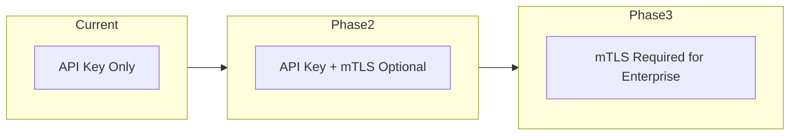
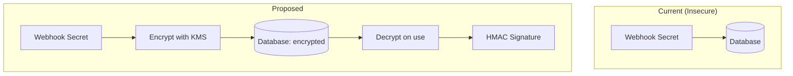
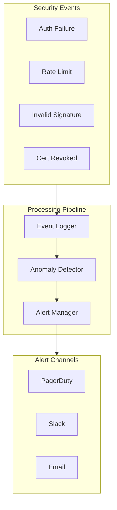
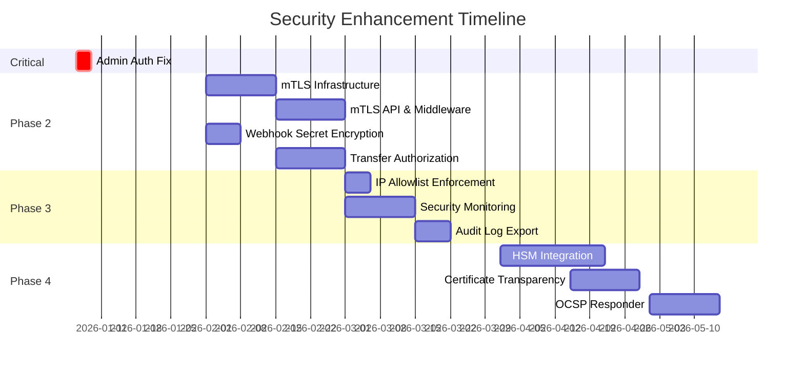

# Post-Launch Security Roadmap

> **Status:** Planning  
> **Created:** January 2026  
> **Owner:** Security Team

## Overview

This document consolidates all security enhancements identified during the broker system security review, organized by priority and implementation phase.

---

## Critical Issues (Pre-Launch Blockers)

### 1. Missing Admin Authentication on Broker Registration

**Status:** Must fix before launch  
**File:** `api-server/src/server.ts:897-900`

```typescript
// Current (INSECURE):
app.post('/api/v1/broker/register',
  // TODO: Add admin authentication middleware  <-- NO AUTH!
  [...validators],
```

**Risk:** Anyone can register a broker, enabling fraudulent content registration.

**Fix Required:**
```typescript
app.post('/api/v1/broker/register',
  requireAdminAuth,  // Add JWT-based admin authentication
  [...validators],
```

**Acceptance Criteria:**
- [ ] Admin JWT middleware implemented
- [ ] Only users with `admin:brokers` scope can register brokers
- [ ] Audit log entry created for each registration
- [ ] Tests cover unauthorized access attempts

---

## High Priority (Phase 2: Post-Launch)

### 2. mTLS for Brokers and Validators

**Status:** Planned  
**Documentation:** [MTLS_BROKER_SECURITY.md](./MTLS_BROKER_SECURITY.md)

**Summary:** Add certificate-based authentication as defense-in-depth alongside API keys.



**Deliverables:**
- [ ] Certificate Authority setup
- [ ] Certificate management API
- [ ] mTLS middleware
- [ ] Nginx/Cloudflare configuration
- [ ] Broker migration guide

### 3. Webhook Secret Encryption

**Status:** Planned  
**File:** `api-server/src/broker/webhook-service.ts:90-108`

**Current:** Webhook secrets stored in plaintext in database.

**Risk:** Database compromise exposes all webhook secrets, allowing attackers to forge webhook deliveries.

**Solution:**



**Implementation:**

```typescript
// Encryption at rest
async function storeWebhookSecret(brokerId: number, secret: string): Promise<void> {
  const encrypted = await kms.encrypt(secret, {
    context: { broker_id: brokerId.toString() }
  });
  
  await db.query(`
    UPDATE broker_webhooks 
    SET secret_encrypted = $1, secret = NULL
    WHERE broker_id = $2
  `, [encrypted, brokerId]);
}

// Decryption on use
async function getWebhookSecret(webhookId: number): Promise<string> {
  const result = await db.query(`
    SELECT secret_encrypted, broker_id FROM broker_webhooks WHERE id = $1
  `, [webhookId]);
  
  return await kms.decrypt(result.rows[0].secret_encrypted, {
    context: { broker_id: result.rows[0].broker_id.toString() }
  });
}
```

**Database Migration:**
```sql
ALTER TABLE broker_webhooks ADD COLUMN secret_encrypted BYTEA;

-- Migration script will encrypt existing secrets
-- Then: ALTER TABLE broker_webhooks DROP COLUMN secret;
```

### 4. Transfer Authorization Enhancement

**Status:** Planned  
**File:** `api-server/src/server.ts:1004-1242`

**Current:** Broker can transfer any user's content if they know the content hash and can claim to be the owner.

**Risk:** Compromised broker could transfer ownership of all content registered through them.

**Solution Options:**

```mermaid
flowchart TB
    subgraph OptionA ["Option A: User Signature"]
        A1[User] -->|Sign transfer request| A2[Broker]
        A2 -->|Forward signature| A3[DAON API]
        A3 -->|Verify Ed25519 sig| A4[Process Transfer]
    end
    
    subgraph OptionB ["Option B: Authorization Code"]
        B1[User] -->|Request transfer| B2[Broker]
        B2 -->|Get auth code| B3[DAON API]
        B3 -->|Email/notify user| B4[User]
        B4 -->|Confirm code| B5[DAON API]
        B5 -->|Process transfer| B6[Complete]
    end
    
    subgraph OptionC ["Option C: Time-locked Intent"]
        C1[Broker] -->|Submit intent| C2[DAON API]
        C2 -->|24h waiting period| C3[User notified]
        C3 -->|No objection| C4[Process Transfer]
        C3 -->|User objects| C5[Cancel Transfer]
    end
```



**Recommended:** Option A (User Signature) for enterprise brokers, Option C (Time-locked) for others.

---

## Medium Priority (Phase 3)

### 5. IP Allowlist Enforcement

**Status:** Optional feature  
**File:** `api-server/src/database/migrations/002_add_broker_system.sql:33`

**Current:** Schema defines `allowed_ip_ranges INET[]` but never enforced.

**Implementation:**

```typescript
// In broker-auth-middleware.ts
if (broker.allowed_ip_ranges?.length > 0) {
  const clientIp = req.ip || req.socket.remoteAddress;
  const isAllowed = broker.allowed_ip_ranges.some(range => 
    ipRangeCheck(clientIp, range)
  );
  
  if (!isAllowed) {
    await brokerService.logSecurityEvent({
      broker_id: broker.id,
      event_type: 'ip_not_whitelisted',
      severity: 'high',
      description: `Request from non-whitelisted IP: ${clientIp}`,
      ip_address: clientIp,
    });
    
    return res.status(403).json({
      success: false,
      error: 'IP address not in allowlist',
      code: 'BROKER_IP_NOT_ALLOWED',
    });
  }
}
```

**Considerations:**
- Only enforce if `allowed_ip_ranges` is non-empty
- Support CIDR notation for ranges
- Handle IPv4 and IPv6
- Log attempts from non-allowed IPs
- Provide clear error messages

### 6. Enhanced Security Event Monitoring

**Status:** Planned

**Current:** Security events logged to database and file.

**Enhancement:** Real-time alerting and anomaly detection.



**Alert Thresholds:**

| Event | Threshold | Severity | Action |
|-------|-----------|----------|--------|
| Auth failures (single broker) | 10/min | High | Alert + temp suspend |
| Auth failures (global) | 100/min | Critical | Alert + investigate |
| Rate limit exceeded | 2x limit | Medium | Alert |
| Rate limit exceeded | 5x limit | High | Auto-suspend |
| Invalid signature | 5/hour | High | Alert |
| Certificate use after revoke | Any | Critical | Alert + block |

### 7. Audit Log Export API

**Status:** Planned

**Purpose:** Allow brokers to export their own audit logs for compliance.

**Endpoints:**
```
GET /api/v1/broker/audit-logs
  ?start_date=2026-01-01
  &end_date=2026-01-31
  &event_types=auth,registration,transfer
  &format=json|csv

POST /api/v1/broker/audit-logs/export
  {
    "start_date": "2026-01-01",
    "end_date": "2026-01-31",
    "delivery": {
      "method": "webhook",
      "url": "https://broker.example.com/audit-receive"
    }
  }
```

---

## Low Priority (Phase 4+)

### 8. Hardware Security Module (HSM) Integration

**Status:** Future consideration

**Purpose:** Store CA private keys and perform signing operations in tamper-resistant hardware.

**Options:**
- AWS CloudHSM
- Azure Dedicated HSM
- YubiHSM 2 (for smaller deployments)
- Tendermint KMS (already planned for validators)

### 9. Certificate Transparency Logging

**Status:** Future consideration

**Purpose:** Publish all issued certificates to public CT logs for auditability.

**Benefits:**
- Detect unauthorized certificate issuance
- Compliance with industry standards
- Public accountability

### 10. OCSP Responder

**Status:** Future consideration

**Purpose:** Real-time certificate status checking (alternative to CRL).

**Benefits:**
- Fresher revocation data than CRL
- Lower bandwidth for clients
- Industry standard

---

## Implementation Timeline



---

## Security Review Checklist

Before each phase goes live:

### Code Review
- [ ] All security-sensitive code reviewed by 2+ engineers
- [ ] No secrets in code or logs
- [ ] Input validation on all endpoints
- [ ] Output encoding to prevent XSS
- [ ] SQL injection prevention verified

### Testing
- [ ] Unit tests for security functions
- [ ] Integration tests for auth flows
- [ ] Penetration testing on new endpoints
- [ ] Load testing for rate limiting

### Documentation
- [ ] API documentation updated
- [ ] Security considerations documented
- [ ] Runbook for incident response
- [ ] Broker migration guide (if applicable)

### Deployment
- [ ] Staged rollout plan
- [ ] Rollback procedure documented
- [ ] Monitoring alerts configured
- [ ] On-call briefed on changes

---

## References

- [MTLS_BROKER_SECURITY.md](./MTLS_BROKER_SECURITY.md) - Detailed mTLS design
- [SECURITY_AUDIT.md](./SECURITY_AUDIT.md) - Full security audit
- [PRE_LAUNCH_CHECKLIST.md](./PRE_LAUNCH_CHECKLIST.md) - Launch requirements
- [TENDERMINT_KMS_SETUP.md](./TENDERMINT_KMS_SETUP.md) - Validator key management

---

## Document History

| Version | Date | Author | Changes |
|---------|------|--------|---------|
| 1.0 | 2026-01-05 | Security Review | Initial draft |
